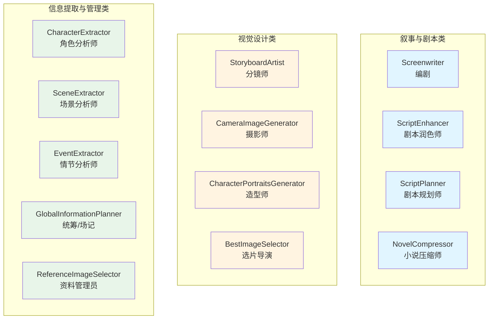
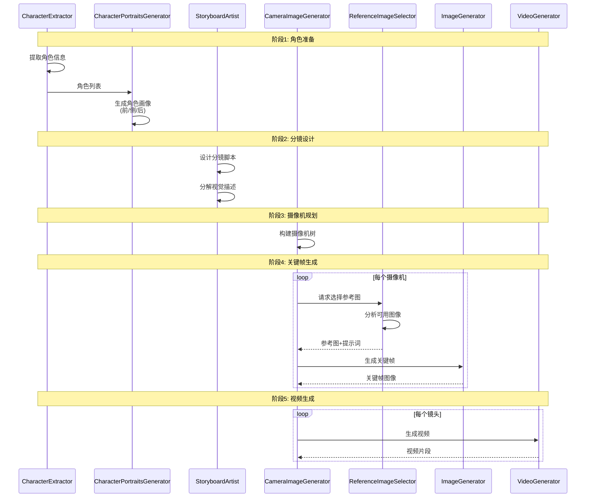
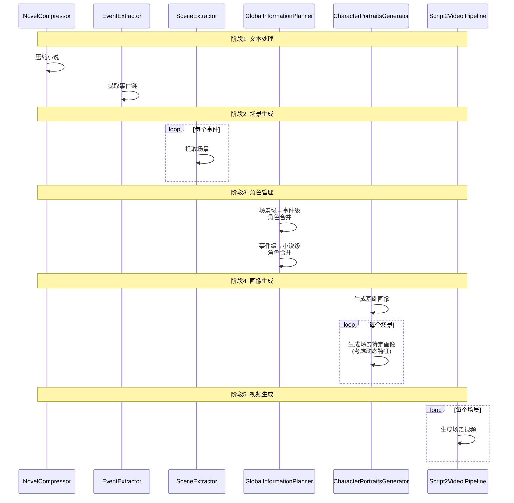
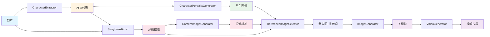
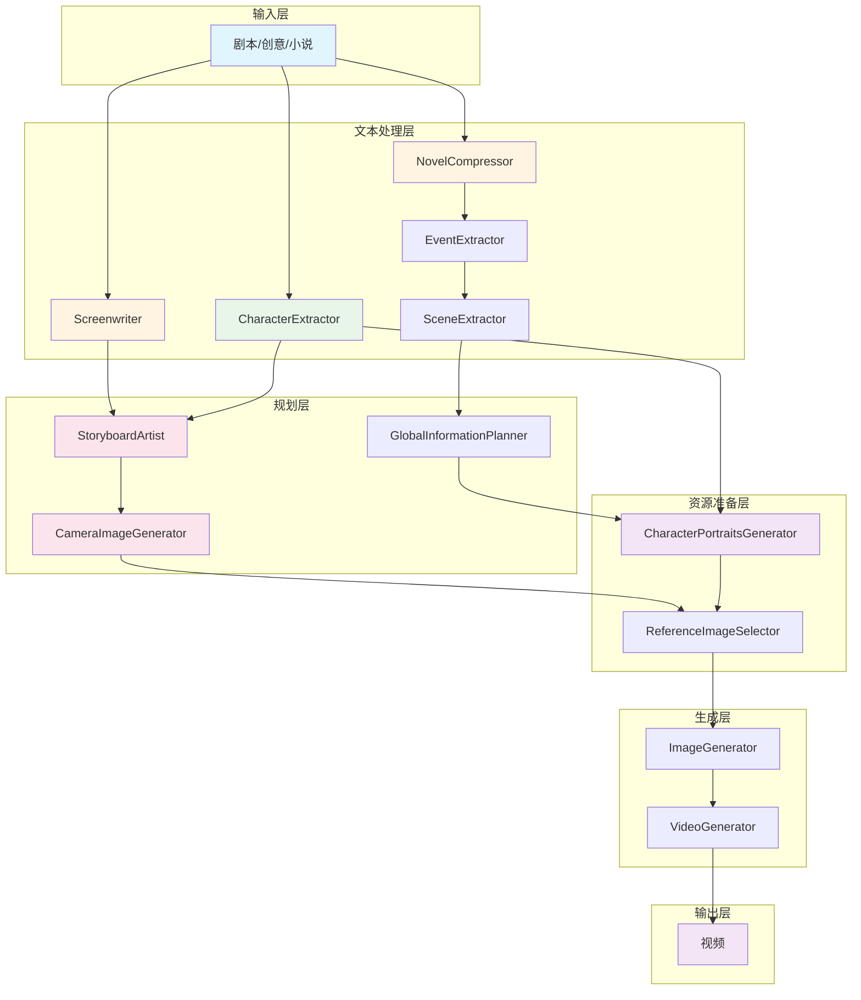

# 智能体 (Agents) 详解

> 深入了解 ViMax 多智能体系统中每个智能体的功能、输入输出和协作关系

## 目录

- [前置知识](#前置知识)
- [智能体分类](#智能体分类)
- [叙事与剧本类](#叙事与剧本类)
- [视觉设计类](#视觉设计类)
- [信息提取与管理类](#信息提取与管理类)
- [智能体协作模式](#智能体协作模式)
- [相关资源](#相关资源)

## 前置知识

在阅读本文档之前，建议您先了解：

- [系统架构](./architecture.md) - 了解智能体在整体架构中的位置
- [核心流水线](./pipelines.md) - 了解智能体如何在流水线中协作
- 多智能体系统的基本概念

---

ViMax 采用多智能体架构，每个智能体都专注于特定的任务。以下是系统中主要智能体的功能介绍。

## 智能体分类

### 智能体总览




---

## 叙事与剧本类

### Screenwriter (编剧)

负责根据用户的创意或大纲编写详细的剧本。它能够理解戏剧结构，创作对话，并描述场景动作。

**核心功能**:
- 扩写创意为完整故事
- 基于故事编写结构化剧本
- 理解戏剧结构和叙事节奏

**输入数据结构**:

```python
# develop_story 方法
idea: str                          # 用户的简短创意
user_requirement: Optional[str]    # 用户需求（如时长、风格、目标受众）

# write_script_based_on_story 方法
story: str                         # 完整故事文本
user_requirement: Optional[str]    # 用户需求（如场景数量、风格）
```

**输出数据结构**:

```python
# develop_story 方法返回
story: str                         # 完整的故事文本

# write_script_based_on_story 方法返回
script: List[str]                  # 结构化的场景剧本列表
                                   # 每个元素是一个场景的完整剧本
```

**使用示例**:

```python
from agents.screenwriter import Screenwriter
from langchain.chat_models import init_chat_model

# 初始化编剧智能体
chat_model = init_chat_model(
    model="gpt-4",
    model_provider="openai",
)
screenwriter = Screenwriter(chat_model=chat_model)

# 1. 从创意扩写为完整故事
idea = "一个程序员发现他的影子有了自己的意识"
user_requirement = "目标受众：成人；类型：科幻悬疑；时长：适合10分钟短片"

story = await screenwriter.develop_story(
    idea=idea,
    user_requirement=user_requirement
)

# 2. 将故事转化为结构化剧本
script_scenes = await screenwriter.write_script_based_on_story(
    story=story,
    user_requirement="分为3个场景"
)

# script_scenes 是一个列表，每个元素是一个场景的剧本
for i, scene_script in enumerate(script_scenes):
    print(f"场景 {i+1}:\n{scene_script}\n")
```

**配置参数**:

| 参数 | 类型 | 说明 | 默认值 |
|------|------|------|--------|
| `chat_model` | `BaseChatModel` | 用于文本生成的语言模型 | 必需 |

**使用场景**:
- Idea2Video 流水线中的故事扩写和剧本创作
- Script2Video 流水线的前置步骤（如果需要从创意开始）

**技术实现**:
- 使用大语言模型（LLM）进行文本生成
- 通过 prompt engineering 确保输出格式符合要求
- 支持多语言输出（输出语言与输入语言一致）
- 使用 Pydantic 模型确保输出结构化

**与其他智能体的协作**:
- **输出到 CharacterExtractor**: 生成的剧本用于提取角色信息
- **输出到 StoryboardArtist**: 生成的剧本用于设计分镜

### ScriptEnhancer (剧本润色师)

对生成的剧本进行优化和润色，使其更符合视觉叙事的要求，增强连贯性、具体性和对话自然度。

**核心功能**:
- 优化剧本的语言表达和视觉描述
- 增强场景连贯性和细节
- 改善对话自然度
- 确保术语和角色名称一致性

**输入数据结构**:

```python
# enhance_script 方法
planned_script: str                # 待润色的剧本文本
```

**输出数据结构**:

```python
# enhance_script 方法返回
enhanced_script: str               # 润色后的剧本文本
```

**使用示例**:

```python
from agents.script_enhancer import ScriptEnhancer

# 初始化剧本润色师智能体
script_enhancer = ScriptEnhancer(
    chat_model="gpt-4",
    base_url="https://api.openai.com/v1",
    api_key="your-api-key",
    model_provider="openai"
)

# 润色剧本
planned_script = """
场景1：办公室
John 走进来。他看起来很累。
Mary: 嗨。
John: 嗨。
"""

enhanced_script = await script_enhancer.enhance_script(
    planned_script=planned_script
)

print(enhanced_script)
# 输出会包含更详细的视觉描述、更自然的对话和更强的连贯性
```

**配置参数**:

| 参数 | 类型 | 说明 | 默认值 |
|------|------|------|--------|
| `chat_model` | `str` | 用于剧本润色的语言模型名称 | 必需 |
| `base_url` | `str` | API 基础 URL | 必需 |
| `api_key` | `str` | API 密钥 | 必需 |
| `model_provider` | `str` | 模型提供商 | "openai" |

**润色原则**:
1. **保持原意**: 不改变原始剧本的情节和结构
2. **增强视觉性**: 添加具体的感官细节（光线、质感、声音、天气等）
3. **确保一致性**: 统一角色名称、年龄、关系和地点
4. **改善对话**: 使对话更简洁、更符合角色特点
5. **避免镜头术语**: 不使用"切到"、"特写"等摄影术语
6. **重复关键信息**: 为精确性重复重要对象和角色信息
7. **角色声音描述**: 为对话中的角色添加声音特征描述

**技术实现**:
- 使用 LLM 进行文本优化
- 使用重试机制（最多3次）
- 结构化输出（Pydantic 模型）

**与其他智能体的协作**:
- **接收自 ScriptPlanner**: 使用规划的剧本进行润色
- **输出到后续流水线**: 提供优化后的剧本用于分镜设计

### ScriptPlanner (剧本规划师)

将简单的创意扩展为完整的剧本，支持三种不同风格：叙事型（narrative）、动作型（motion）和蒙太奇型（montage）。

**核心功能**:
- 智能路由：根据创意内容自动选择合适的剧本风格
- 叙事型剧本：注重角色对话、情节发展和主题深度
- 动作型剧本：强调动作、速度、技术细节和动态描述
- 蒙太奇型剧本：通过镜头序列和节奏传达情感弧线

**输入数据结构**:

```python
# plan_script 方法
basic_idea: str                    # 简单的故事创意或概念
```

**输出数据结构**:

```python
# plan_script 方法返回
planned_script: str                # 完整的规划剧本
```

**使用示例**:

```python
from agents.script_planner import ScriptPlanner

# 初始化剧本规划师智能体
script_planner = ScriptPlanner(
    chat_model="gpt-4",
    base_url="https://api.openai.com/v1",
    api_key="your-api-key",
    model_provider="openai"
)

# 示例1：叙事型创意
narrative_idea = "一个程序员发现他的影子有了自己的意识"
narrative_script = script_planner.plan_script(basic_idea=narrative_idea)

# 示例2：动作型创意
motion_idea = "F-18 战斗机从航母上起飞的完整过程"
motion_script = script_planner.plan_script(basic_idea=motion_idea)

# 示例3：蒙太奇型创意
montage_idea = "一个小女孩学习小提琴，从初学到精通的成长历程"
montage_script = script_planner.plan_script(basic_idea=montage_idea)
```

**配置参数**:

| 参数 | 类型 | 说明 | 默认值 |
|------|------|------|--------|
| `chat_model` | `str` | 用于剧本规划的语言模型名称 | 必需 |
| `base_url` | `str` | API 基础 URL | 必需 |
| `api_key` | `str` | API 密钥 | 必需 |
| `model_provider` | `str` | 模型提供商 | "openai" |

**三种剧本风格**:

1. **Narrative (叙事型)**:
   - 适用于：角色驱动的故事、对话丰富的场景
   - 特点：三幕结构、角色发展、情感深度
   - 示例：人物关系剧、悬疑故事

2. **Motion (动作型)**:
   - 适用于：动作场景、竞速、战斗、运动
   - 特点：技术精确性、动态描述、空间连贯性
   - 示例：赛车、战斗机、体育竞技

3. **Montage (蒙太奇型)**:
   - 适用于：情感表达、时间压缩、成长历程
   - 特点：镜头序列、情感弧线、视觉对比
   - 示例：训练蒙太奇、成长历程、情感变化

**技术实现**:
- 两阶段处理：先路由意图，再生成剧本
- 使用 LLM 进行意图分类和剧本生成
- 使用重试机制确保稳定性
- 结构化输出（Pydantic 模型）

**与其他智能体的协作**:
- **输出到 ScriptEnhancer**: 提供规划的剧本进行润色
- **输出到后续流水线**: 提供完整剧本用于视频生成

### NovelCompressor (小说压缩师)

专门用于 Novel2Video 流水线。它将长篇小说文本进行智能压缩和摘要，保留核心情节和关键细节，以便后续处理。

**核心功能**:
- 切分长篇小说为块
- 并行压缩各块内容
- 合并压缩结果，处理重叠内容

**输入数据结构**:

```python
# split 方法
novel_text: str                    # 完整的小说文本

# compress 方法
index_chunk_pairs: List[Tuple[int, str]]  # 索引和文本块的配对列表
max_concurrent_tasks: int = 5      # 最大并发任务数

# aggregate 方法
compressed_novel_chunks: List[str] # 压缩后的文本块列表
```

**输出数据结构**:

```python
# split 方法返回
List[str]                          # 切分后的文本块列表

# compress 方法返回
List[Tuple[int, str]]              # 索引和压缩后文本的配对列表

# aggregate 方法返回
str                                # 聚合后的完整压缩文本
```

**使用示例**:

```python
from agents.novel_compressor import NovelCompressor

# 初始化小说压缩师智能体
novel_compressor = NovelCompressor(
    api_key="your-api-key",
    base_url="https://api.openai.com/v1",
    chat_model="gpt-4",
    chunk_size=65536,              # 每块大小（字符数）
    chunk_overlap=8192             # 块之间的重叠（字符数）
)

# 读取长篇小说
with open("novel.txt", "r", encoding="utf-8") as f:
    novel_text = f.read()

# 1. 切分小说
novel_chunks = novel_compressor.split(novel_text)
print(f"切分为 {len(novel_chunks)} 个块")

# 2. 并行压缩各块
index_chunk_pairs = list(enumerate(novel_chunks))
compressed_chunks = await novel_compressor.compress(
    index_chunk_pairs=index_chunk_pairs,
    max_concurrent_tasks=5
)

# 3. 聚合压缩结果
compressed_chunks_sorted = [chunk for _, chunk in sorted(compressed_chunks)]
aggregated_novel = novel_compressor.aggregate(compressed_chunks_sorted)

print(f"原始长度: {len(novel_text)} 字符")
print(f"压缩后长度: {len(aggregated_novel)} 字符")
print(f"压缩比: {len(aggregated_novel) / len(novel_text) * 100:.1f}%")
```

**配置参数**:

| 参数 | 类型 | 说明 | 默认值 |
|------|------|------|--------|
| `api_key` | `str` | API 密钥 | 必需 |
| `base_url` | `str` | API 基础 URL | 必需 |
| `chat_model` | `str` | 用于压缩的语言模型名称 | 必需 |
| `chunk_size` | `int` | 每个文本块的大小（字符数） | 65536 |
| `chunk_overlap` | `int` | 块之间的重叠大小（字符数） | 8192 |

**关键方法**:

1. **split**: 切分小说文本
   - 使用 RecursiveCharacterTextSplitter
   - 支持自定义块大小和重叠
   - 保持文本的自然分割点

2. **compress**: 并行压缩文本块
   - 异步并发处理多个块
   - 使用信号量控制并发数
   - 保留核心情节和关键细节
   - 消除冗余描述

3. **aggregate**: 聚合压缩结果
   - 智能处理块之间的重叠内容
   - 合并语义相似的重复段落
   - 确保文本流畅连贯

**压缩原则**:
1. **保真度**: 保留所有主要情节点、转折和揭示
2. **角色一致性**: 保持角色行为、决策和发展
3. **简化描述**: 减少冗长的环境和人物描述
4. **浓缩内心独白**: 提炼角色思考的核心内容
5. **简化语言**: 使用更直接简洁的表达
6. **保持连贯**: 确保压缩后文本流畅可读

**技术实现**:
- 使用 RecursiveCharacterTextSplitter 切分文本
- 使用 LLM 进行智能摘要压缩
- 异步并行处理提高效率
- 智能聚合处理重叠内容

**与其他智能体的协作**:
- **输出到 EventExtractor**: 提供压缩后的小说用于事件提取
- **用于 Novel2Video 流水线**: 作为长篇小说处理的第一步

---

## 视觉设计类

### StoryboardArtist (分镜师)

将文字剧本转化为视觉分镜。它决定了每个镜头的构图、角度（如特写、远景）、光影和氛围。

**核心功能**:
- 设计分镜脚本
- 分解详细的视觉描述
- 确定镜头类型和摄像机角度

**输入数据结构**:

```python
# design_storyboard 方法
script: str                        # 场景剧本文本
characters: List[CharacterInScene] # 角色列表
user_requirement: Optional[str]    # 用户需求（如镜头数量、风格）
retry_timeout: int = 150           # 超时时间（秒）

# decompose_visual_description 方法
shot_brief_desc: ShotBriefDescription  # 简要镜头描述
characters: List[CharacterInScene]     # 角色列表
retry_timeout: int = 150               # 超时时间（秒）
```

**输出数据结构**:

```python
# design_storyboard 方法返回
List[ShotBriefDescription]         # 分镜简要描述列表

class ShotBriefDescription:
    idx: int                       # 镜头索引
    is_last: bool                  # 是否为最后一个镜头
    cam_idx: int                   # 摄像机索引
    visual_desc: str               # 视觉描述
    audio_desc: str                # 音频描述

# decompose_visual_description 方法返回
ShotDescription                    # 详细镜头描述

class ShotDescription:
    idx: int                       # 镜头索引
    is_last: bool                  # 是否为最后一个镜头
    cam_idx: int                   # 摄像机索引
    visual_desc: str               # 完整视觉描述
    variation_type: str            # 变化类型：large/medium/small
    variation_reason: str          # 变化原因说明
    ff_desc: str                   # 首帧描述
    ff_vis_char_idxs: List[int]    # 首帧可见角色索引
    lf_desc: str                   # 末帧描述
    lf_vis_char_idxs: List[int]    # 末帧可见角色索引
    motion_desc: str               # 运动描述
    audio_desc: str                # 音频描述
```

**使用示例**:

```python
from agents.storyboard_artist import StoryboardArtist
from agents.character_extractor import CharacterExtractor
from langchain.chat_models import init_chat_model

# 初始化分镜师智能体
chat_model = init_chat_model(model="gpt-4", model_provider="openai")
storyboard_artist = StoryboardArtist(chat_model=chat_model)

# 假设已有剧本和角色列表
script = "..."  # 场景剧本
characters = [...]  # 从 CharacterExtractor 获取的角色列表

# 1. 设计分镜脚本
shot_brief_descs = await storyboard_artist.design_storyboard(
    script=script,
    characters=characters,
    user_requirement="不超过10个镜头，强调角色的情感变化"
)

# 2. 分解每个镜头的视觉描述
shot_descs = []
for shot_brief in shot_brief_descs:
    shot_desc = await storyboard_artist.decompose_visual_description(
        shot_brief_desc=shot_brief,
        characters=characters
    )
    shot_descs.append(shot_desc)
    print(f"镜头 {shot_desc.idx}:")
    print(f"  首帧: {shot_desc.ff_desc}")
    print(f"  末帧: {shot_desc.lf_desc}")
    print(f"  运动: {shot_desc.motion_desc}")
    print(f"  变化程度: {shot_desc.variation_type}")
```

**配置参数**:

| 参数 | 类型 | 说明 | 默认值 |
|------|------|------|--------|
| `chat_model` | `BaseChatModel` | 用于分镜设计的语言模型 | 必需 |
| `retry_timeout` | `int` | 单次调用超时时间（秒） | 150 |

**关键方法**:

1. **design_storyboard**: 设计分镜脚本
   - 分析剧本，划分镜头
   - 为每个镜头分配摄像机索引
   - 生成视觉和音频描述
   - 使用重试机制（最多3次）

2. **decompose_visual_description**: 分解视觉描述
   - 将简要描述分解为首帧、末帧和运动描述
   - 标注可见角色
   - 判断变化程度（small/medium/large）
   - 确保首帧和末帧为静态快照

**技术亮点**:
- 使用专业的电影语言（镜头类型、角度、运动）
- 智能判断镜头变化程度（large: 构图大幅变化；medium: 新角色出现或角色转身；small: 表情或姿势变化）
- 确保角色名称一致性（使用 `<角色名>` 格式）
- 支持异步并发处理
- 内置重试机制提高稳定性

**与其他智能体的协作**:
- **接收自 Screenwriter**: 使用生成的剧本进行分镜设计
- **接收自 CharacterExtractor**: 使用提取的角色信息确保一致性
- **输出到 CameraImageGenerator**: 提供详细的镜头描述用于图像生成


### CameraImageGenerator (摄影师/图像生成)

根据分镜描述和参考图，调用底层图像生成工具生成高质量的静态图像。它负责处理复杂的视觉提示词。

**核心功能**:
- 构建摄像机树
- 生成转场视频
- 提取新摄像机的首帧
- 生成关键帧图像

**输入数据结构**:

```python
# construct_camera_tree 方法
cameras: List[Camera]                          # 摄像机列表
shot_descs: List[Union[ShotDescription,        # 镜头描述列表
                       ShotBriefDescription]]

# generate_transition_video 方法
first_shot_visual_desc: str                    # 第一个镜头的视觉描述
second_shot_visual_desc: str                   # 第二个镜头的视觉描述
first_shot_ff_path: str                        # 第一个镜头首帧的路径

# get_new_camera_image 方法
transition_video_path: str                     # 转场视频路径

# generate_first_frame 方法
shot_desc: ShotDescription                     # 镜头描述
character_portrait_path_and_text_pairs:        # 角色画像路径和描述对
    List[Tuple[str, str]]
```

**输出数据结构**:

```python
# construct_camera_tree 方法返回
List[Camera]                                   # 更新后的摄像机列表

class Camera:
    idx: int                                   # 摄像机索引
    active_shot_idxs: List[int]                # 该摄像机拍摄的镜头索引列表
    parent_cam_idx: Optional[int]              # 父摄像机索引
    parent_shot_idx: Optional[int]             # 依赖的父镜头索引
    reason: Optional[str]                      # 选择父摄像机的原因
    is_parent_fully_covers_child: Optional[bool]  # 父镜头是否完全覆盖子镜头
    missing_info: Optional[str]                # 子镜头中缺失的信息

# generate_transition_video 方法返回
VideoOutput                                    # 转场视频

# get_new_camera_image 方法返回
ImageOutput                                    # 新摄像机的首帧图像

# generate_first_frame 方法返回
ImageOutput                                    # 生成的首帧图像
```

**使用示例**:

```python
from agents.camera_image_generator import CameraImageGenerator
from tools.image_generator_doubao_seedream_yunwu_api import ImageGenerator
from tools.video_generator_doubao_seedance_yunwu_api import VideoGenerator

# 初始化摄影师智能体
chat_model = init_chat_model(model="gpt-4", model_provider="openai")
image_generator = ImageGenerator(...)
video_generator = VideoGenerator(...)

camera_image_gen = CameraImageGenerator(
    chat_model=chat_model,
    image_generator=image_generator,
    video_generator=video_generator
)

# 1. 构建摄像机树
cameras = [...]  # 从分镜中提取的摄像机列表
shot_descs = [...]  # 镜头描述列表

cameras = await camera_image_gen.construct_camera_tree(
    cameras=cameras,
    shot_descs=shot_descs
)

# 2. 生成转场视频（用于新摄像机）
transition_video = await camera_image_gen.generate_transition_video(
    first_shot_visual_desc="中景镜头，Alice 和 Bob 面对面站立",
    second_shot_visual_desc="特写镜头，Alice 的脸部表情",
    first_shot_ff_path="path/to/first_shot_ff.png"
)

# 3. 从转场视频提取新摄像机首帧
new_camera_image = camera_image_gen.get_new_camera_image(
    transition_video_path=transition_video.path
)

# 4. 生成关键帧
first_frame = await camera_image_gen.generate_first_frame(
    shot_desc=shot_descs[0],
    character_portrait_path_and_text_pairs=[
        ("path/to/alice_front.png", "Alice 的正面画像"),
        ("path/to/bob_front.png", "Bob 的正面画像")
    ]
)
```

**配置参数**:

| 参数 | 类型 | 说明 | 默认值 |
|------|------|------|--------|
| `chat_model` | `BaseChatModel` | 用于分析摄像机关系的语言模型 | 必需 |
| `image_generator` | `ImageGenerator` | 图像生成工具 | 必需 |
| `video_generator` | `VideoGenerator` | 视频生成工具 | 必需 |

**关键方法**:

1. **construct_camera_tree**: 构建摄像机树
   - 分析镜头之间的关系
   - 建立父子关系（基于内容包含关系）
   - 优化生成顺序
   - 第一个摄像机必须是根节点

2. **generate_transition_video**: 生成转场视频
   - 基于父镜头的首帧生成转场
   - 确保镜头之间的平滑过渡
   - 使用参考图像保持一致性

3. **get_new_camera_image**: 提取新摄像机首帧
   - 使用场景检测（ContentDetector）分割转场视频
   - 提取第二个场景的首帧
   - 如果检测失败，使用转场视频的最后一帧

4. **generate_first_frame**: 生成关键帧
   - 基于镜头描述和角色画像生成图像
   - 使用多个参考图像确保一致性

**摄像机树的作用**:
- 提高角色和场景的一致性
- 优化关键帧生成顺序
- 支持镜头转场视频生成
- 减少生成的随机性
- 建立镜头之间的逻辑关系

**技术亮点**:
- 智能分析镜头包含关系（从宽景到特写）
- 支持镜头/反打镜头关系
- 使用场景检测技术分割视频
- 异步并发处理提高效率

**与其他智能体的协作**:
- **接收自 StoryboardArtist**: 使用镜头描述构建摄像机树
- **接收自 CharacterPortraitsGenerator**: 使用角色画像作为参考
- **接收自 ReferenceImageSelector**: 使用选择的参考图像
- **输出到 VideoGenerator**: 提供关键帧用于视频生成

### CharacterPortraitsGenerator (造型师)

基于提取的角色特征，生成角色的标准画像（Character Portrait）。这些画像将作为后续视频生成的参考（Reference），以保持角色一致性。

**核心功能**:
- 生成角色的前视图画像
- 生成角色的侧视图画像
- 生成角色的后视图画像

**输入数据结构**:

```python
# generate_front_portrait 方法
character: CharacterInScene        # 角色信息
style: str                         # 视觉风格（如"realistic", "cartoon"）

# generate_side_portrait 方法
character: CharacterInScene        # 角色信息
front_image_path: str              # 前视图画像路径

# generate_back_portrait 方法
character: CharacterInScene        # 角色信息
front_image_path: str              # 前视图画像路径
```

**输出数据结构**:

```python
# 所有方法返回
ImageOutput                        # 生成的画像图像

class ImageOutput:
    fmt: str                       # 格式（如 "pil", "base64"）
    ext: str                       # 扩展名（如 "png", "jpg"）
    data: Any                      # 图像数据
```

**使用示例**:

```python
from agents.character_portraits_generator import CharacterPortraitsGenerator
from tools.image_generator_doubao_seedream_yunwu_api import ImageGenerator

# 初始化造型师智能体
image_generator = ImageGenerator(...)
portraits_gen = CharacterPortraitsGenerator(
    image_generator=image_generator
)

# 假设已有角色信息
character = CharacterInScene(
    idx=0,
    identifier_in_scene="Alice",
    static_features="年轻女性，长棕色头发，绿色眼睛",
    dynamic_features="穿着花裙子和牛仔夹克",
    is_visible=True
)

# 1. 生成前视图画像
front_portrait = await portraits_gen.generate_front_portrait(
    character=character,
    style="realistic"
)
# 保存图像
front_path = "output/alice_front.png"
front_portrait.save(front_path)

# 2. 生成侧视图画像（基于前视图）
side_portrait = await portraits_gen.generate_side_portrait(
    character=character,
    front_image_path=front_path
)
side_path = "output/alice_side.png"
side_portrait.save(side_path)

# 3. 生成后视图画像（基于前视图）
back_portrait = await portraits_gen.generate_back_portrait(
    character=character,
    front_image_path=front_path
)
back_path = "output/alice_back.png"
back_portrait.save(back_path)

# 并行生成多个角色的画像
import asyncio

characters = [...]  # 多个角色
tasks = [
    portraits_gen.generate_front_portrait(char, "realistic")
    for char in characters
]
front_portraits = await asyncio.gather(*tasks)
```

**配置参数**:

| 参数 | 类型 | 说明 | 默认值 |
|------|------|------|--------|
| `image_generator` | `ImageGenerator` | 图像生成工具 | 必需 |

**关键方法**:

1. **generate_front_portrait**: 生成前视图
   - 基于角色的静态特征和动态特征
   - 全身、正面、白色背景
   - 角色居中，占据大部分画面
   - 直视前方，自然表情
   - 使用重试机制（最多3次）

2. **generate_side_portrait**: 生成侧视图
   - 基于前视图作为参考
   - 保持角色一致性
   - 侧面朝左，白色背景
   - 使用重试机制（最多3次）

3. **generate_back_portrait**: 生成后视图
   - 基于前视图作为参考
   - 保持角色一致性
   - 不显示面部特征
   - 使用重试机制（最多3次）

**技术实现**:
- 调用图像生成工具（ImageGenerator）
- 使用参考图像确保一致性
- 异步并行生成多个角色
- 内置重试机制提高成功率
- 使用详细的提示词确保画像质量

**画像用途**:
- 作为后续图像生成的参考
- 确保角色在不同镜头中的一致性
- 支持不同角度的角色展示
- 为 ReferenceImageSelector 提供基础素材

**与其他智能体的协作**:
- **接收自 CharacterExtractor**: 使用提取的角色特征
- **输出到 ReferenceImageSelector**: 提供角色画像作为参考图像
- **输出到 CameraImageGenerator**: 提供角色画像用于关键帧生成

### BestImageSelector (选片导演)

为了保证质量和一致性，系统通常会为同一个分镜生成多张候选图像。BestImageSelector 利用多模态大模型（MLLM）从候选图中挑选出质量最高、且与前后文最一致的一张。

**核心功能**:
- 评估候选图像的角色一致性
- 评估候选图像的空间一致性
- 评估候选图像与文本描述的匹配度
- 选择综合表现最佳的图像

**输入数据结构**:

```python
# __call__ 方法
reference_image_path_and_text_pairs: List[Tuple[str, str]]  # 参考图像路径和描述对
target_description: str                                      # 目标图像的描述
candidate_image_paths: List[str]                            # 候选图像路径列表
```

**输出数据结构**:

```python
# __call__ 方法返回
str                                    # 最佳图像的路径
```

**使用示例**:

```python
from agents.best_image_selector import BestImageSelector

# 初始化选片导演智能体
best_selector = BestImageSelector(
    base_url="https://api.openai.com/v1",
    api_key="your-api-key",
    chat_model="gpt-4-vision-preview"
)

# 准备参考图像
reference_images = [
    ("path/to/alice_portrait.png", "Alice 的正面画像：年轻女性，长棕色头发"),
    ("path/to/previous_frame.png", "上一帧：Alice 站在办公室门口")
]

# 目标描述
target_desc = "Alice 走进办公室，表情严肃"

# 候选图像
candidates = [
    "path/to/candidate_1.png",
    "path/to/candidate_2.png",
    "path/to/candidate_3.png"
]

# 选择最佳图像
best_image_path = await best_selector(
    reference_image_path_and_text_pairs=reference_images,
    target_description=target_desc,
    candidate_image_paths=candidates
)

print(f"选中的最佳图像: {best_image_path}")
```

**配置参数**:

| 参数 | 类型 | 说明 | 默认值 |
|------|------|------|--------|
| `base_url` | `str` | API 基础 URL | 必需 |
| `api_key` | `str` | API 密钥 | 必需 |
| `chat_model` | `str` | 多模态语言模型名称 | 必需 |

**评估标准**:

1. **角色一致性**（优先级最高）
   - 性别、种族、年龄
   - 面部特征（眼睛、鼻子、嘴巴等）
   - 体型和身材
   - 外观（服装、发型等）

2. **空间一致性**
   - 角色相对位置（如 A 在左，B 在右）
   - 场景布局和透视
   - 物体排列
   - 视角和构图

3. **描述准确性**
   - 是否包含文本描述的关键元素
   - 动作和姿态是否匹配
   - 场景和氛围是否符合
   - 物体和道具是否正确

4. **图像质量**
   - 避免白边、黑边或额外边框
   - 图像清晰度
   - 整体视觉质量

**选择原则**:
- 如果多张图像部分满足标准，选择综合一致性最高的
- 如果没有理想图像，选择相对最佳的并说明不足
- 确保关键元素都存在于选中的图像中
- 基于客观比较，避免主观偏好

**技术实现**:
- 使用多模态大模型（MLLM）进行图像评估
- 使用重试机制（最多3次）
- 结构化输出（Pydantic 模型）
- 自动验证索引有效性
- 将图像转换为 base64 格式传输

**与其他智能体的协作**:
- **接收自图像生成工具**: 评估生成的候选图像
- **接收自 CharacterPortraitsGenerator**: 使用角色画像作为参考
- **接收自 CameraImageGenerator**: 使用之前的帧作为参考
- **输出到流水线**: 提供选中的最佳图像用于后续处理

---

## 信息提取与管理类

### CharacterExtractor (角色分析师)

从剧本或小说中提取角色的详细信息，包括外貌特征（发色、服装）、性格特点和身份背景。

**核心功能**:
- 识别剧本中的所有角色
- 提取角色的静态特征（外貌、体型等相对不变的特征）
- 提取角色的动态特征（服装、配饰等易变特征）

**输入数据结构**:

```python
# extract_characters 方法
script: str                        # 剧本或故事文本
```

**输出数据结构**:

```python
# extract_characters 方法返回
List[CharacterInScene]             # 角色列表

class CharacterInScene:
    idx: int                       # 角色索引
    identifier_in_scene: str       # 场景中的标识符（角色名或描述）
    static_features: str           # 静态特征（外貌、体型、发色等）
    dynamic_features: Optional[str]  # 动态特征（服装、配饰、携带物品等）
    is_visible: bool               # 是否在场景中可见
```

**使用示例**:

```python
from agents.character_extractor import CharacterExtractor
from langchain.chat_models import init_chat_model

# 初始化角色分析师智能体
chat_model = init_chat_model(model="gpt-4", model_provider="openai")
character_extractor = CharacterExtractor(chat_model=chat_model)

# 提取角色信息
script = """
场景：咖啡馆内部 - 白天

Alice 坐在靠窗的位置，她是一位年轻女性，长棕色头发，穿着花裙子和牛仔夹克。
她正在看着窗外，手里拿着一杯咖啡。

Bob 走进咖啡馆，他是一位高大的男性，短黑发，穿着蓝色衬衫和黑色裤子。
他看到 Alice 后，走向她的桌子。

Bob: 嗨，Alice！好久不见！
Alice: Bob！真是惊喜！
"""

characters = await character_extractor.extract_characters(script=script)

for char in characters:
    print(f"角色 {char.idx}: {char.identifier_in_scene}")
    print(f"  静态特征: {char.static_features}")
    print(f"  动态特征: {char.dynamic_features}")
    print(f"  是否可见: {char.is_visible}")
    print()

# 输出示例:
# 角色 0: Alice
#   静态特征: 年轻女性，长棕色头发
#   动态特征: 穿着花裙子和牛仔夹克，手里拿着一杯咖啡
#   是否可见: True
#
# 角色 1: Bob
#   静态特征: 高大的男性，短黑发
#   动态特征: 穿着蓝色衬衫和黑色裤子
#   是否可见: True
```

**配置参数**:

| 参数 | 类型 | 说明 | 默认值 |
|------|------|------|--------|
| `chat_model` | `BaseChatModel` | 用于文本分析的语言模型 | 必需 |

**技术实现**:
- 使用 LLM 进行文本分析
- 结构化输出（Pydantic 模型）
- 使用重试机制（最多3次）
- 自动合并同一实体的不同名称
- 为未命名角色生成合理的标识符（如"年轻女性"、"咖啡师"）

**特征提取原则**:
1. **静态特征**: 描述相对不变的特征
   - 性别、年龄、种族
   - 身高、体型
   - 面部特征（眼睛、鼻子、发型等）
   - 不包括性格、角色关系等抽象信息

2. **动态特征**: 描述易变的特征
   - 服装、配饰
   - 携带的物品
   - 当前状态（如"受伤"、"疲惫"）

3. **角色识别**:
   - 合并同一实体的不同名称
   - 忽略背景角色
   - 为真实名人保留真实姓名
   - 使用职业或显著特征命名未命名角色

4. **特征设计**:
   - 详细且可视化（避免抽象描述）
   - 使用具体的颜色、形状描述
   - 确保不同角色外观有明显区别

**与其他智能体的协作**:
- **接收自 Screenwriter**: 使用生成的剧本提取角色
- **输出到 CharacterPortraitsGenerator**: 提供角色特征用于生成画像
- **输出到 StoryboardArtist**: 提供角色列表用于分镜设计
- **输出到 GlobalInformationPlanner**: 提供角色信息用于跨场景管理


### SceneExtractor (场景分析师)

将事件描述转化为具体的场景（Scene），结合 RAG 检索的上下文片段生成详细的场景剧本。

**核心功能**:
- 从事件描述中提取场景
- 基于上下文片段生成场景剧本
- 识别场景中的角色和环境
- 提取角色的静态和动态特征

**输入数据结构**:

```python
# get_next_scene 方法
relevant_chunks: List[str]         # RAG 检索的相关文本片段
event: Event                       # 事件对象
previous_scenes: List[Scene]       # 已提取的场景列表
```

**输出数据结构**:

```python
# get_next_scene 方法返回
Scene                              # 场景对象

class Scene:
    idx: int                       # 场景索引
    environment: Environment       # 环境信息（slugline 和描述）
    characters: List[CharacterInScene]  # 场景中的角色列表
    script: str                    # 场景剧本
```

**使用示例**:

```python
from agents.scene_extractor import SceneExtractor
from interfaces import Event

# 初始化场景分析师智能体
scene_extractor = SceneExtractor(
    api_key="your-api-key",
    base_url="https://api.openai.com/v1",
    chat_model="gpt-4"
)

# 假设已有事件和相关文本片段
event = Event(
    index=0,
    title="博物馆盗窃",
    description="小偷从博物馆偷走宝石后被追捕",
    process_chain=[...],
    characters=["小偷", "警卫"],
    time="深夜",
    location="城市博物馆",
    is_last=False
)

relevant_chunks = [
    "深夜，博物馆的警报突然响起...",
    "小偷敏捷地撬开展示柜...",
    # 更多相关文本片段
]

# 提取场景
scene = await scene_extractor.get_next_scene(
    relevant_chunks=relevant_chunks,
    event=event,
    previous_scenes=[]
)

print(f"场景 {scene.idx}:")
print(f"环境: {scene.environment.slugline}")
print(f"角色: {[c.identifier_in_scene for c in scene.characters]}")
print(f"剧本:\n{scene.script}")
```

**配置参数**:

| 参数 | 类型 | 说明 | 默认值 |
|------|------|------|--------|
| `api_key` | `str` | API 密钥 | 必需 |
| `base_url` | `str` | API 基础 URL | 必需 |
| `chat_model` | `str` | 用于场景提取的语言模型名称 | 必需 |

**场景提取原则**:
1. **基于原文**: 尽可能保留原文的对话和描述
2. **关注相关性**: 只使用与事件直接相关的上下文片段
3. **标准格式**: 使用行业标准的剧本格式
4. **简洁视觉化**: 描述简洁且易于视觉化
5. **逻辑推断**: 在上下文不足时进行合理推断
6. **场景划分**: 时间或地点变化时创建新场景
7. **角色个体化**: 角色必须是个体，不是群体

**技术实现**:
- 使用 LLM 进行场景提取和剧本生成
- 使用重试机制（最多5次）
- 结构化输出（Pydantic 模型）
- 支持多场景迭代提取

**与其他智能体的协作**:
- **接收自 EventExtractor**: 使用提取的事件信息
- **接收 RAG 系统**: 使用检索的相关文本片段
- **输出到 GlobalInformationPlanner**: 提供场景和角色信息用于合并
- **用于 Novel2Video 流水线**: 作为事件到场景转换的关键步骤

### EventExtractor (情节分析师)

从长篇小说中迭代提取关键事件（Event），构建故事的骨架和事件链。

**核心功能**:
- 迭代提取关键事件
- 构建完整的事件链
- 识别事件的时间、地点和参与角色
- 提供详细的过程链描述

**输入数据结构**:

```python
# __call__ 方法
novel_text: str                    # 完整的小说文本（通常是压缩后的）

# extract_next_event 方法（内部使用）
novel_text: str                    # 小说文本
extracted_events: List[Event]      # 已提取的事件列表
```

**输出数据结构**:

```python
# __call__ 方法返回
List[Event]                        # 完整的事件列表

class Event:
    index: int                     # 事件索引
    title: str                     # 事件标题
    description: str               # 事件描述
    process_chain: List[str]       # 详细的过程链
    characters: List[str]          # 参与角色列表
    time: str                      # 时间框架
    location: str                  # 地点
    is_last: bool                  # 是否为最后一个事件
```

**使用示例**:

```python
from agents.event_extractor import EventExtractor

# 初始化情节分析师智能体
event_extractor = EventExtractor(
    api_key="your-api-key",
    base_url="https://api.openai.com/v1",
    chat_model="gpt-4"
)

# 假设已有压缩后的小说文本
compressed_novel = """
深夜，博物馆的警报突然响起。一个小偷刚刚撬开展示柜，
偷走了被称为"海洋之心"的蓝宝石...
（更多小说内容）
"""

# 提取所有事件
events = event_extractor(novel_text=compressed_novel)

# 查看提取的事件
for event in events:
    print(f"\n事件 {event.index}: {event.title}")
    print(f"描述: {event.description}")
    print(f"时间: {event.time}")
    print(f"地点: {event.location}")
    print(f"角色: {', '.join(event.characters)}")
    print(f"过程链:")
    for i, process in enumerate(event.process_chain, 1):
        print(f"  {i}. {process}")
```

**配置参数**:

| 参数 | 类型 | 说明 | 默认值 |
|------|------|------|--------|
| `api_key` | `str` | API 密钥 | 必需 |
| `base_url` | `str` | API 基础 URL | 必需 |
| `chat_model` | `str` | 用于事件提取的语言模型名称 | 必需 |

**事件提取原则**:
1. **关键性**: 只提取对情节、角色发展或主题深度关键的事件
2. **逻辑独立性**: 每个事件在逻辑上与前后事件区分
3. **统一目标**: 跨多个场景的事件应统一在单一戏剧目标下
4. **客观性**: 基于文本描述事件，不加入解释或判断
5. **详细过程**: 提供逐步的事件进展，包括关键行动、决策和转折点
6. **忠实原文**: 所有细节必须直接来自原文，不添加或假设信息

**过程链示例**:

```
事件: 追逐与逮捕
时间框架: 盗窃发生后的当晚
角色: Elara（小偷）和 Kaelen（警卫队长）
起因: 小偷触发警报，警卫开始追捕
过程:
1. 小偷从博物馆后门冲出，穿过狭窄的小巷，警卫紧追不舍并呼叫支援
2. 追逐转移到屋顶，小偷展现出惊人的敏捷性，在建筑物之间跳跃
3. 警卫队长 Kaelen 预判小偷的路线，设置路障
4. 小偷被困在死胡同，试图反抗但被制服
5. 宝石被找回，小偷被押送到警局
结果: 小偷被捕，宝石归还，但小偷的身份和动机仍是谜团
```

**技术实现**:
- 迭代调用 LLM 提取事件
- 使用重试机制（最多3次）
- 结构化输出（Pydantic 模型）
- 自动验证事件索引连续性
- 循环直到 `is_last=True`

**与其他智能体的协作**:
- **接收自 NovelCompressor**: 使用压缩后的小说文本
- **输出到 SceneExtractor**: 提供事件信息用于场景提取
- **输出到 GlobalInformationPlanner**: 提供事件信息用于角色管理
- **用于 Novel2Video 流水线**: 作为小说到事件转换的关键步骤

### GlobalInformationPlanner (统筹/场记)

负责维护全局的角色一致性信息。它在三个层级（场景级、事件级、小说级）管理角色信息，追踪角色在不同场景和事件中的状态变化，确保角色特征的一致性。

**核心功能**:
- 合并场景级角色信息到事件级
- 合并事件级角色信息到小说级
- 追踪角色的动态特征变化
- 维护角色标识符的一致性
- 识别和合并同一角色的不同名称

**输入数据结构**:

```python
# merge_characters_across_scenes_in_event 方法
event_idx: int                     # 事件索引
scenes: List[Scene]                # 场景列表

# merge_characters_to_existing_characters_in_novel 方法
event_idx: int                     # 事件索引
existing_characters_in_novel: List[CharacterInNovel]  # 已有的小说级角色
characters_in_event: List[CharacterInEvent]           # 事件级角色
```

**输出数据结构**:

```python
# merge_characters_across_scenes_in_event 方法返回
List[CharacterInEvent]             # 事件级角色列表

class CharacterInEvent:
    index: int                     # 角色索引
    identifier_in_event: str       # 事件中的标识符
    static_features: str           # 静态特征
    active_scenes: Dict[int, str]  # 活跃场景映射 {场景索引: 场景中的标识符}

# merge_characters_to_existing_characters_in_novel 方法返回
List[CharacterInNovel]             # 更新后的小说级角色列表

class CharacterInNovel:
    index: int                     # 角色索引
    identifier_in_novel: str       # 小说中的标识符
    static_features: str           # 静态特征
    active_events: Dict[int, str]  # 活跃事件映射 {事件索引: 事件中的标识符}
```

**使用示例**:

```python
from agents.global_information_planner import GlobalInformationPlanner
from interfaces import Scene, CharacterInNovel

# 初始化统筹智能体
global_planner = GlobalInformationPlanner(
    api_key="your-api-key",
    base_url="https://api.openai.com/v1",
    chat_model="gpt-4"
)

# 假设已有场景列表
scenes = [...]  # 从 SceneExtractor 获取的场景列表

# 1. 合并场景级角色到事件级
event_idx = 0
characters_in_event = await global_planner.merge_characters_across_scenes_in_event(
    event_idx=event_idx,
    scenes=scenes
)

print(f"事件 {event_idx} 中的角色:")
for char in characters_in_event:
    print(f"  {char.identifier_in_event}")
    print(f"    出现在场景: {list(char.active_scenes.keys())}")
    print(f"    静态特征: {char.static_features}")

# 2. 合并事件级角色到小说级
existing_characters = []  # 初始为空，或从之前的事件累积
updated_characters = global_planner.merge_characters_to_existing_characters_in_novel(
    event_idx=event_idx,
    existing_characters_in_novel=existing_characters,
    characters_in_event=characters_in_event
)

print(f"\n小说中的角色:")
for char in updated_characters:
    print(f"  {char.identifier_in_novel}")
    print(f"    出现在事件: {list(char.active_events.keys())}")
    print(f"    静态特征: {char.static_features}")
```

**配置参数**:

| 参数 | 类型 | 说明 | 默认值 |
|------|------|------|--------|
| `api_key` | `str` | API 密钥 | 必需 |
| `base_url` | `str` | API 基础 URL | 必需 |
| `chat_model` | `str` | 用于角色合并的语言模型名称 | 必需 |

**关键方法**:

1. **merge_characters_across_scenes_in_event**: 场景级 → 事件级
   - 分析多个场景的剧本和角色
   - 识别同一角色的不同名称（如"John"和"约翰"）
   - 统一角色标识符
   - 聚合静态特征
   - 记录角色在各场景中的名称
   - 验证输出完整性

2. **merge_characters_to_existing_characters_in_novel**: 事件级 → 小说级
   - 比较事件角色与已有小说角色
   - 识别新角色和已有角色
   - 区分同名但不同的角色（如年轻和年老的同一人物）
   - 更新或扩展角色特征
   - 维护角色在各事件中的出现记录

**角色合并原则**:
1. **上下文分析**: 使用对话风格、情节角色、关系和描述判断角色身份
2. **唯一标识符**: 为每个合并角色分配一致的唯一 ID
3. **场景映射**: 记录角色在每个场景/事件中使用的名称
4. **完整性**: 确保所有角色都被包含，无重复或遗漏
5. **特征一致性**: 严格比较特征，区分相似但不同的角色
6. **角色分割**: 如果角色有显著变化（如儿童到成人），分为不同角色

**三级角色管理**:

```
场景级 (CharacterInScene)
  ↓ merge_characters_across_scenes_in_event
事件级 (CharacterInEvent)
  ↓ merge_characters_to_existing_characters_in_novel
小说级 (CharacterInNovel)
```

**技术实现**:
- 使用 LLM 进行智能角色匹配
- 使用重试机制（最多3次）
- 结构化输出（Pydantic 模型）
- 自动验证输出完整性
- 支持增量更新

**与其他智能体的协作**:
- **接收自 SceneExtractor**: 使用场景和角色信息
- **输出到 CharacterPortraitsGenerator**: 提供统一的角色信息用于生成画像
- **用于 Novel2Video 流水线**: 作为角色一致性管理的核心组件

### ReferenceImageSelector (资料管理员)

为当前生成的镜头选择最合适的参考图像。它不仅使用角色的标准画像，还会根据剧情需要检索之前的关键帧，以维持视觉连贯性。

**核心功能**:
- 从可用图像中选择最相关的参考图
- 生成优化的提示词指导图像生成
- 确保角色和场景的一致性
- 两阶段筛选策略（文本预筛选 + 多模态精选）

**输入数据结构**:

```python
# select_reference_images_and_generate_prompt 方法
available_image_path_and_text_pairs: List[Tuple[str, str]]  # 可用图像路径和描述对
frame_description: str                                       # 目标帧的描述
```

**输出数据结构**:

```python
# select_reference_images_and_generate_prompt 方法返回
{
    "reference_image_path_and_text_pairs": List[Tuple[str, str]],  # 选中的参考图像
    "text_prompt": str                                              # 生成的文本提示词
}
```

**使用示例**:

```python
from agents.reference_image_selector import ReferenceImageSelector

# 初始化资料管理员智能体
ref_selector = ReferenceImageSelector(
    chat_model=chat_model  # 多模态语言模型
)

# 准备可用图像
available_images = [
    ("path/to/alice_front.png", "Alice 的正面画像"),
    ("path/to/bob_front.png", "Bob 的正面画像"),
    ("path/to/scene1_frame.png", "[摄像机 0] 中景镜头，Alice 和 Bob 面对面站立"),
    ("path/to/scene2_frame.png", "[摄像机 1] 从 Alice 肩膀拍摄，Bob 在画面中心"),
    # 更多图像...
]

# 目标帧描述
frame_desc = """
[摄像机 1] 从 Alice 肩膀拍摄的镜头。Alice 在靠近摄像机的一侧，
只有她的肩膀出现在画面左下角。Bob 在远离摄像机的一侧，
位于画面中心偏右。Bob 的表情从惊讶转为高兴，因为他认出了 Alice。
"""

# 选择参考图像并生成提示词
result = await ref_selector.select_reference_images_and_generate_prompt(
    available_image_path_and_text_pairs=available_images,
    frame_description=frame_desc
)

print("选中的参考图像:")
for path, desc in result["reference_image_path_and_text_pairs"]:
    print(f"  - {desc}")

print(f"\n生成的提示词:\n{result['text_prompt']}")
```

**配置参数**:

| 参数 | 类型 | 说明 | 默认值 |
|------|------|------|--------|
| `chat_model` | `BaseChatModel` | 多模态语言模型 | 必需 |

**两阶段选择策略**:

1. **阶段1：文本预筛选**（当图像数量 ≥ 8 时）
   - 使用纯文本模型分析图像描述
   - 基于文本相似度初步筛选
   - 减少需要多模态分析的图像数量
   - 提高效率

2. **阶段2：多模态精选**
   - 使用多模态模型分析实际图像
   - 综合考虑视觉内容和文本描述
   - 选择最多 8 张最相关的参考图
   - 生成详细的文本提示词

**选择策略**:
1. **构图相似性**: 优先选择相似构图的图像（同一摄像机）
2. **时间接近性**: 优先选择时间上更近的图像
3. **避免冗余**: 不选择包含重复信息的图像
4. **角色画像**: 为新出现的角色优先选择其画像
5. **视角匹配**: 根据目标帧选择合适的角色视角（正面/侧面/背面）
6. **数量限制**: 最多选择 8 张参考图

**提示词生成**:
- 明确指定哪些元素应参考哪张图像
- 使用 "Image N" 格式引用参考图像（N 为索引）
- 提供清晰的图像生成指导
- 保持语言与输入描述一致

**技术实现**:
- 使用多模态大模型（MLLM）进行图像分析
- 使用重试机制（最多3次）
- 结构化输出（Pydantic 模型）
- 支持大规模图像库的高效筛选

**与其他智能体的协作**:
- **接收自 CharacterPortraitsGenerator**: 使用角色画像作为参考
- **接收自 CameraImageGenerator**: 使用之前生成的关键帧
- **输出到 CameraImageGenerator**: 提供选中的参考图像和提示词
- **输出到图像生成工具**: 提供参考图像用于生成新图像

---

## 智能体协作模式

### Script2Video 中的协作流程




### Novel2Video 中的协作流程



### 智能体间的数据流



### 智能体协作关系图



---

## 相关资源

### 深入学习

- **[系统架构](./architecture.md)** - 了解智能体在整体架构中的位置
- **[核心流水线](./pipelines.md)** - 了解智能体如何在流水线中协作
- **[开发指南](./development.md)** - 学习如何创建自定义智能体
- **[API 参考](./api_reference.md)** - 查看智能体的详细 API 文档

### 智能体设计原则

1. **单一职责**: 每个智能体专注于一个特定任务
2. **松耦合**: 智能体之间通过标准接口通信
3. **可组合**: 智能体可以灵活组合形成新的流水线
4. **可扩展**: 易于添加新的智能体

### 自定义智能体

如果您想创建自定义智能体，请遵循以下步骤：

1. **定义接口**: 确定智能体的输入和输出
2. **实现逻辑**: 编写智能体的核心功能
3. **集成测试**: 在流水线中测试智能体
4. **文档化**: 编写使用文档

参考 [开发指南](./development.md) 了解详细步骤。

### 常见问题

**Q: 智能体之间如何通信？**

A: 智能体之间通过以下方式通信：
- 直接调用方法
- 共享数据结构（如角色注册表）
- 事件机制（asyncio.Event）
- 文件系统（JSON/图像文件）

**Q: 可以跳过某些智能体吗？**

A: 可以，但需要确保：
- 提供必要的输入数据
- 不影响后续智能体的工作
- 例如，如果已有角色画像，可以跳过 CharacterPortraitsGenerator

**Q: 如何优化智能体的性能？**

A: 
- 使用缓存机制避免重复计算
- 启用异步并行处理
- 使用更快的 LLM 或图像生成模型
- 优化提示词减少 token 消耗

**Q: 智能体的输出格式是什么？**

A: 智能体使用 Pydantic 模型定义输出格式，确保：
- 类型安全
- 数据验证
- 易于序列化和反序列化
- 参考 `interfaces/` 目录查看所有数据模型

---

**下一步**: 阅读 [核心流水线](./pipelines.md) 了解智能体如何在流水线中协作，或查看 [开发指南](./development.md) 学习如何创建自定义智能体。
