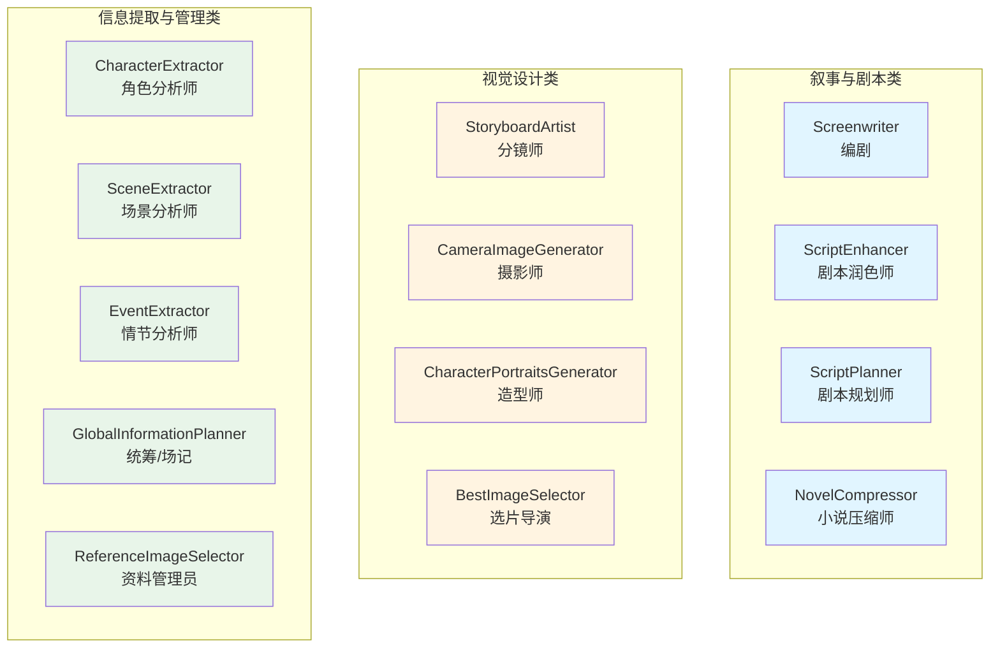
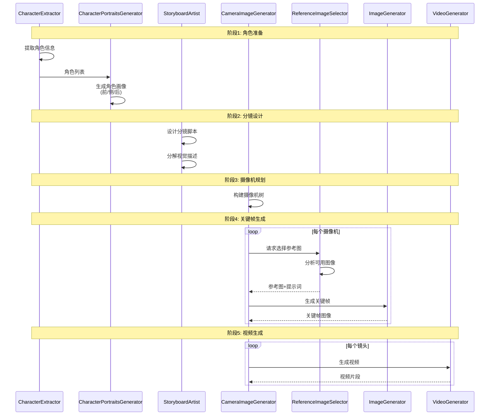
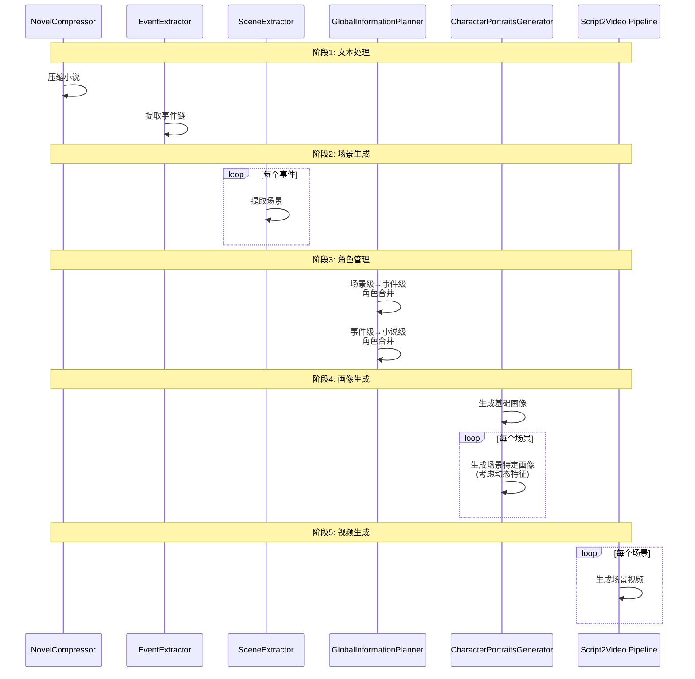
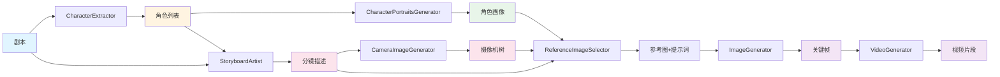
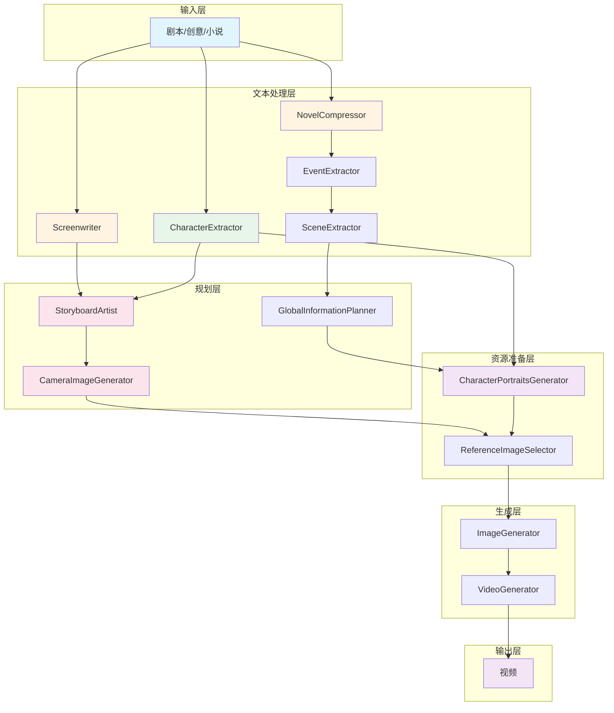

# 智能体 (Agents) 详解

> 深入了解 ViMax 多智能体系统中每个智能体的功能、输入输出和协作关系

## 目录

- [前置知识](#前置知识)
- [智能体分类](#智能体分类)
- [叙事与剧本类](#叙事与剧本类)
- [视觉设计类](#视觉设计类)
- [信息提取与管理类](#信息提取与管理类)
- [智能体协作模式](#智能体协作模式)
- [相关资源](#相关资源)

## 前置知识

在阅读本文档之前，建议您先了解：

- [系统架构](./architecture.md) - 了解智能体在整体架构中的位置
- [核心流水线](./pipelines.md) - 了解智能体如何在流水线中协作
- 多智能体系统的基本概念

---

ViMax 采用多智能体架构，每个智能体都专注于特定的任务。以下是系统中主要智能体的功能介绍。

## 智能体分类

### 智能体总览




---

## 叙事与剧本类

### Screenwriter (编剧)

负责根据用户的创意或大纲编写详细的剧本。它能够理解戏剧结构，创作对话，并描述场景动作。

**核心功能**:
- 扩写创意为完整故事
- 基于故事编写结构化剧本
- 理解戏剧结构和叙事节奏

**输入**:
- `idea`: 用户的简短创意
- `user_requirement`: 用户需求（如时长、风格）
- `story`: 完整故事文本（用于编写剧本）

**输出**:
- 完整的故事文本
- 结构化的场景剧本列表

**使用场景**:
- Idea2Video 流水线中的故事扩写和剧本创作

**技术实现**:
- 使用大语言模型（LLM）进行文本生成
- 通过 prompt engineering 确保输出格式符合要求

### ScriptEnhancer (剧本润色师)

对生成的剧本进行优化和润色，使其更符合视觉叙事的要求，或者调整剧本的风格（如更幽默、更黑暗）。

**核心功能**:
- 优化剧本的语言表达
- 调整剧本风格和基调
- 增强视觉叙事效果

**输入**:
- 原始剧本
- 风格要求

**输出**:
- 优化后的剧本

### ScriptPlanner (剧本规划师)

在长视频生成中，负责规划整体的剧情走向和结构，确保故事的连贯性。

**核心功能**:
- 规划剧情结构
- 确保故事连贯性
- 平衡各场景的节奏

**输入**:
- 故事梗概
- 目标时长

**输出**:
- 剧情大纲

### NovelCompressor (小说压缩师)

专门用于 Novel2Video 流水线。它将长篇小说文本进行智能压缩和摘要，保留核心情节和关键细节，以便后续处理。

**核心功能**:
- 切分长篇小说为块
- 并行压缩各块内容
- 合并压缩结果

**输入**:
- 长篇小说文本（可能数十万字）

**输出**:
- 压缩后的小说文本
- 压缩比通常在 20-40%

**技术实现**:
- 使用 RecursiveCharacterTextSplitter 切分文本
- 使用 LLM 进行摘要压缩
- 异步并行处理多个块

---

## 视觉设计类

### StoryboardArtist (分镜师)

将文字剧本转化为视觉分镜。它决定了每个镜头的构图、角度（如特写、远景）、光影和氛围。

**核心功能**:
- 设计分镜脚本
- 分解详细的视觉描述
- 确定镜头类型和摄像机角度

**输入**:
- 剧本文本
- 角色列表
- 用户需求

**输出**:
- 分镜简要描述列表（`ShotBriefDescription`）
- 详细镜头描述列表（`ShotDescription`）

**关键方法**:

1. **design_storyboard**: 设计分镜脚本
   - 分析剧本，划分镜头
   - 为每个镜头分配摄像机索引
   - 生成视觉和音频描述

2. **decompose_visual_description**: 分解视觉描述
   - 将简要描述分解为首帧、末帧和运动描述
   - 标注可见角色
   - 判断变化程度（small/medium/large）

**技术亮点**:
- 使用专业的电影语言（镜头类型、角度、运动）
- 智能判断镜头变化程度
- 确保角色名称一致性


### CameraImageGenerator (摄影师/图像生成)

根据分镜描述和参考图，调用底层图像生成工具生成高质量的静态图像。它负责处理复杂的视觉提示词。

**核心功能**:
- 构建摄像机树
- 生成转场视频
- 提取新摄像机的首帧
- 生成关键帧图像

**输入**:
- 镜头描述
- 角色画像
- 参考图像

**输出**:
- 摄像机树结构（`Camera` 列表）
- 转场视频
- 关键帧图像

**关键方法**:

1. **construct_camera_tree**: 构建摄像机树
   - 分析镜头之间的关系
   - 建立父子关系
   - 优化生成顺序

2. **generate_transition_video**: 生成转场视频
   - 基于父镜头的首帧生成转场
   - 确保镜头之间的平滑过渡

3. **get_new_camera_image**: 提取新摄像机首帧
   - 使用场景检测分割转场视频
   - 提取第二个场景的首帧

**摄像机树的作用**:
- 提高角色和场景的一致性
- 优化关键帧生成顺序
- 支持镜头转场视频生成
- 减少生成的随机性

### CharacterPortraitsGenerator (造型师)

基于提取的角色特征，生成角色的标准画像（Character Portrait）。这些画像将作为后续视频生成的参考（Reference），以保持角色一致性。

**核心功能**:
- 生成角色的前视图画像
- 生成角色的侧视图画像
- 生成角色的后视图画像

**输入**:
- 角色信息（`CharacterInScene`）
- 视觉风格

**输出**:
- 角色画像图像（前/侧/后视图）

**关键方法**:

1. **generate_front_portrait**: 生成前视图
   - 基于角色的静态特征
   - 全身、正面、白色背景

2. **generate_side_portrait**: 生成侧视图
   - 基于前视图作为参考
   - 保持角色一致性

3. **generate_back_portrait**: 生成后视图
   - 基于前视图作为参考
   - 保持角色一致性

**技术实现**:
- 调用图像生成工具（ImageGenerator）
- 使用参考图像确保一致性
- 异步并行生成多个角色

### BestImageSelector (选片导演)

为了保证质量和一致性，系统通常会为同一个分镜生成多张候选图像。BestImageSelector 利用多模态大模型（MLLM）从候选图中挑选出质量最高、且与前后文最一致的一张。

**核心功能**:
- 评估候选图像质量
- 选择最佳图像
- 确保前后一致性

**输入**:
- 候选图像列表
- 镜头描述
- 前后文图像

**输出**:
- 最佳图像

**技术实现**:
- 使用多模态大模型（MLLM）进行图像评估
- 综合考虑质量、一致性和相关性

---

## 信息提取与管理类

### CharacterExtractor (角色分析师)

从剧本或小说中提取角色的详细信息，包括外貌特征（发色、服装）、性格特点和身份背景。

**核心功能**:
- 识别剧本中的所有角色
- 提取角色的静态特征（外貌、服装）
- 提取角色的动态特征（状态、情绪）

**输入**:
- 剧本或故事文本

**输出**:
- 角色列表（`CharacterInScene`）

**数据结构**:
```python
class CharacterInScene:
    idx: int                          # 角色索引
    identifier_in_scene: str          # 场景中的标识符
    static_features: str              # 静态特征（外貌）
    dynamic_features: Optional[str]   # 动态特征（状态）
    is_visible: bool                  # 是否可见
```

**技术实现**:
- 使用 LLM 进行文本分析
- 结构化输出（Pydantic 模型）


### SceneExtractor (场景分析师)

将长文本或事件流拆解为具体的场景（Scene），明确场景的时间、地点和参与人物。

**核心功能**:
- 从事件中提取场景
- 生成场景剧本
- 识别场景中的角色和环境

**输入**:
- 事件信息
- 相关文本块（RAG 检索结果）

**输出**:
- 场景列表（`Scene`）

**使用场景**:
- Novel2Video 流水线中的场景提取

### EventExtractor (情节分析师)

从长篇小说中提取关键事件（Event），构建故事的骨架。

**核心功能**:
- 迭代提取关键事件
- 构建事件链
- 识别事件的时间、地点和角色

**输入**:
- 压缩后的小说文本
- 已提取的事件列表

**输出**:
- 事件列表（`Event`）

**数据结构**:
```python
class Event:
    index: int                        # 事件索引
    title: str                        # 事件标题
    process_chain: List[str]          # 过程链
    characters: List[str]             # 参与角色
    time: str                         # 时间
    location: str                     # 地点
    is_last: bool                     # 是否为最后一个事件
```

**技术实现**:
- 迭代调用 LLM 提取事件
- 直到 `is_last=True`

### GlobalInformationPlanner (统筹/场记)

负责维护全局的一致性信息。它追踪角色在不同场景中的状态变化（如是否受伤、是否换了衣服），并确保环境细节在不同镜头间保持一致。

**核心功能**:
- 合并场景级角色信息到事件级
- 合并事件级角色信息到小说级
- 追踪角色的动态特征变化
- 维护角色标识符的一致性

**输入**:
- 场景列表
- 角色信息

**输出**:
- 事件级角色信息（`CharacterInEvent`）
- 小说级角色信息（`CharacterInNovel`）

**关键方法**:

1. **merge_characters_across_scenes_in_event**: 场景级 → 事件级
   - 统一同一事件中不同场景的角色
   - 合并角色特征

2. **merge_characters_to_existing_characters_in_novel**: 事件级 → 小说级
   - 跨事件合并角色信息
   - 追踪角色在不同事件中的出现
   - 维护角色的静态特征一致性

**技术亮点**:
- 三级角色管理（场景级 → 事件级 → 小说级）
- 动态特征追踪
- 角色标识符映射

### ReferenceImageSelector (资料管理员)

为当前生成的镜头选择最合适的参考图像。它不仅使用角色的标准画像，还会根据剧情需要检索之前的关键帧，以维持视觉连贯性。

**核心功能**:
- 从可用图像中选择最相关的参考图
- 生成优化的提示词
- 确保角色和场景的一致性

**输入**:
- 可用图像路径和描述列表
- 帧描述

**输出**:
- 选中的参考图像列表
- 优化的文本提示词

**关键方法**:

**select_reference_images_and_generate_prompt**: 选择参考图像并生成提示词
- 两阶段选择策略：
  1. 使用纯文本模型初步筛选（如果图像数量 ≥ 8）
  2. 使用多模态模型精确选择
- 生成详细的提示词指导图像生成

**选择策略**:
- 优先选择相似构图的图像（同一摄像机）
- 优先选择时间上更近的图像
- 避免重复信息
- 为新角色优先选择画像
- 最多选择 8 张参考图

**技术实现**:
- 使用多模态大模型（MLLM）进行图像分析
- 结合文本和图像信息进行选择
- 生成结构化的提示词

---

## 智能体协作模式

### Script2Video 中的协作流程




### Novel2Video 中的协作流程



### 智能体间的数据流



### 智能体协作关系图



---

## 相关资源

### 深入学习

- **[系统架构](./architecture.md)** - 了解智能体在整体架构中的位置
- **[核心流水线](./pipelines.md)** - 了解智能体如何在流水线中协作
- **[开发指南](./development.md)** - 学习如何创建自定义智能体
- **[API 参考](./api_reference.md)** - 查看智能体的详细 API 文档

### 智能体设计原则

1. **单一职责**: 每个智能体专注于一个特定任务
2. **松耦合**: 智能体之间通过标准接口通信
3. **可组合**: 智能体可以灵活组合形成新的流水线
4. **可扩展**: 易于添加新的智能体

### 自定义智能体

如果您想创建自定义智能体，请遵循以下步骤：

1. **定义接口**: 确定智能体的输入和输出
2. **实现逻辑**: 编写智能体的核心功能
3. **集成测试**: 在流水线中测试智能体
4. **文档化**: 编写使用文档

参考 [开发指南](./development.md) 了解详细步骤。

### 常见问题

**Q: 智能体之间如何通信？**

A: 智能体之间通过以下方式通信：
- 直接调用方法
- 共享数据结构（如角色注册表）
- 事件机制（asyncio.Event）
- 文件系统（JSON/图像文件）

**Q: 可以跳过某些智能体吗？**

A: 可以，但需要确保：
- 提供必要的输入数据
- 不影响后续智能体的工作
- 例如，如果已有角色画像，可以跳过 CharacterPortraitsGenerator

**Q: 如何优化智能体的性能？**

A: 
- 使用缓存机制避免重复计算
- 启用异步并行处理
- 使用更快的 LLM 或图像生成模型
- 优化提示词减少 token 消耗

**Q: 智能体的输出格式是什么？**

A: 智能体使用 Pydantic 模型定义输出格式，确保：
- 类型安全
- 数据验证
- 易于序列化和反序列化
- 参考 `interfaces/` 目录查看所有数据模型

---

**下一步**: 阅读 [核心流水线](./pipelines.md) 了解智能体如何在流水线中协作，或查看 [开发指南](./development.md) 学习如何创建自定义智能体。
