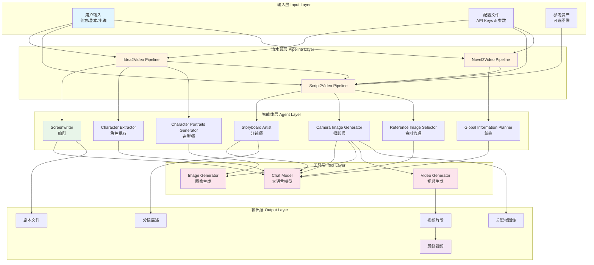
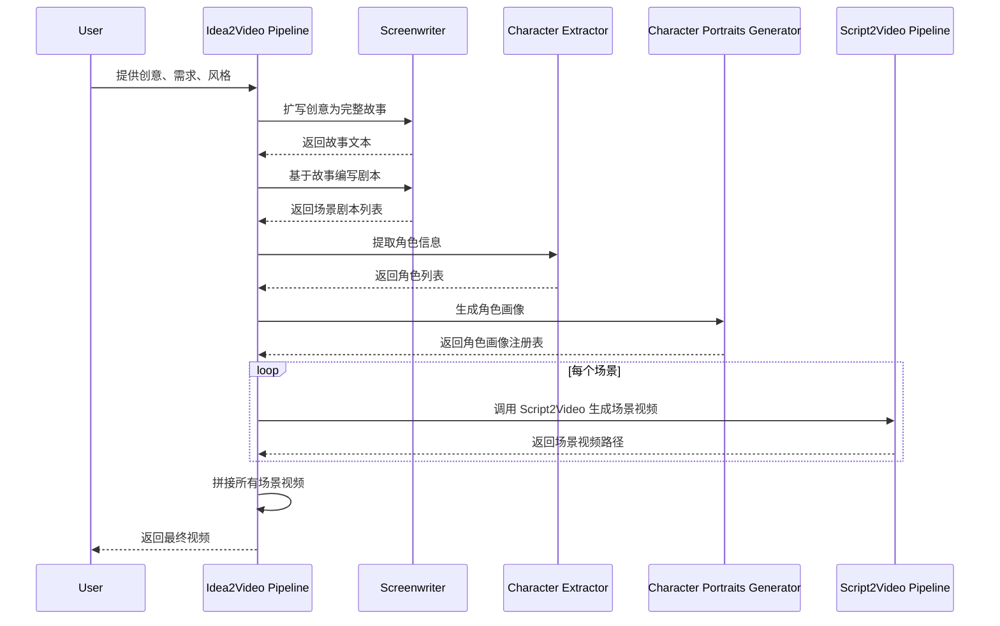
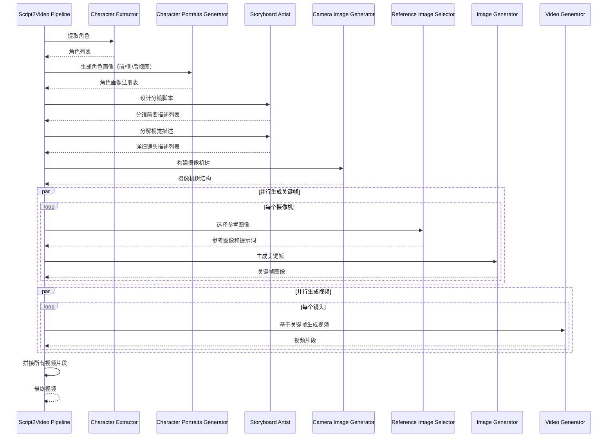
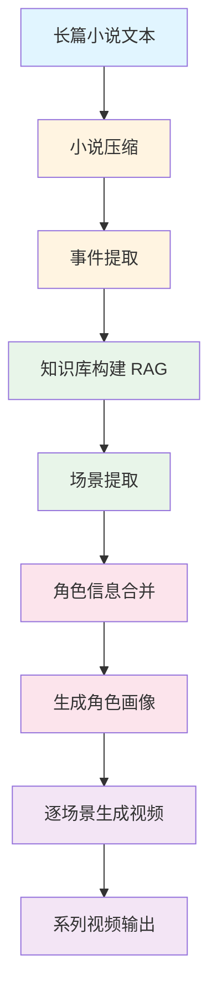
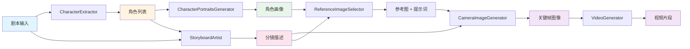
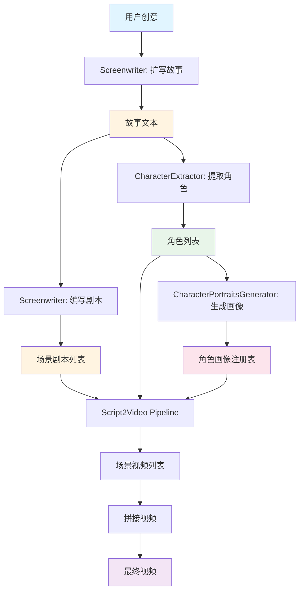
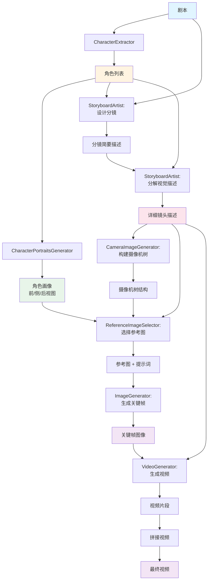

# 系统架构

> 深入了解 ViMax 的多智能体架构设计和工作原理

## 目录

- [前置知识](#前置知识)
- [核心设计理念](#核心设计理念)
- [系统架构概览](#系统架构概览)
- [架构层次详解](#架构层次详解)
- [多智能体协作机制](#多智能体协作机制)
- [数据流与交互](#数据流与交互)
- [目录结构说明](#目录结构说明)
- [相关资源](#相关资源)

## 前置知识

在阅读本文档之前，建议您先了解：

- [快速开始](./getting_started.md) - 了解如何运行 ViMax
- 基本的视频制作流程（剧本、分镜、拍摄、剪辑）
- 多智能体系统的基本概念

## 核心设计理念

传统的 AI 视频生成工具通常只能生成几秒钟的片段，且难以保持角色和场景的一致性。ViMax 通过以下设计理念解决了这些问题：

### 1. 分层规划 (Hierarchical Planning)

ViMax 采用自顶向下的分层规划策略：

```
创意/小说 → 事件 → 场景 → 分镜 → 镜头 → 视频片段 → 完整视频
```

每一层都有专门的智能体负责处理，确保从宏观到微观的逐步细化。

### 2. 多智能体协作 (Multi-Agent Collaboration)

不同的智能体扮演不同的角色，模拟真实的影视制作团队：

- **编剧 (Screenwriter)**: 创作剧本和故事
- **导演 (Director)**: 规划整体视觉风格
- **分镜师 (Storyboard Artist)**: 设计每个镜头的构图
- **摄影师 (Cinematographer)**: 生成关键帧图像
- **剪辑师 (Editor)**: 合成最终视频

### 3. 全局一致性维护 (Global Consistency)

通过以下机制确保长视频中的一致性：

- **角色画像 (Character Portraits)**: 为每个角色生成标准形象
- **参考图像选择 (Reference Image Selection)**: 智能选择最合适的参考图
- **全局信息规划 (Global Information Planning)**: 跨场景追踪角色和环境状态
- **摄像机树 (Camera Tree)**: 管理镜头之间的连续性

### 4. 异步并行处理 (Asynchronous Parallel Processing)

利用 Python 的 asyncio 框架，实现：

- 多个智能体并行工作
- 图像和视频的批量生成
- 高效的资源利用


## 系统架构概览

### 整体架构图



### 架构层次

ViMax 采用分层架构，从上到下依次为：

1. **输入层 (Input Layer)** - 接收用户输入和配置
2. **流水线层 (Pipeline Layer)** - 协调整体工作流程
3. **智能体层 (Agent Layer)** - 执行具体任务
4. **工具层 (Tool Layer)** - 调用外部 AI 服务
5. **输出层 (Output Layer)** - 生成各类产物


## 架构层次详解

### 1. 输入层 (Input Layer)

输入层负责接收和验证用户提供的各类输入。

**输入类型**：

- **文本输入**:
  - 创意描述（Idea2Video）
  - 完整剧本（Script2Video）
  - 长篇小说（Novel2Video）
  
- **配置输入**:
  - API Keys（必需）
  - 模型选择（chat_model, image_generator, video_generator）
  - 工作目录路径
  
- **约束输入**:
  - 用户需求（user_requirement）
  - 视觉风格（style）
  - 场景数量、镜头数量等限制
  
- **资产输入**（可选）:
  - 参考图像
  - 角色画像
  - 环境素材

**数据验证**：

输入层会进行基本的验证：
- 检查 API Key 是否存在
- 验证配置文件格式
- 确保工作目录可写

### 2. 流水线层 (Pipeline Layer)

流水线层是系统的核心调度中心，负责协调各个智能体的工作流程。

#### Idea2Video Pipeline

将简单创意扩展为完整视频的流水线。

**工作流程**：



**关键方法**：

- `develop_story()`: 扩写创意为故事
- `write_script_based_on_story()`: 基于故事编写剧本
- `extract_characters()`: 提取角色信息
- `generate_character_portraits()`: 生成角色画像
- `__call__()`: 主流程执行


#### Script2Video Pipeline

将剧本转换为视频的核心流水线。

**工作流程**：



**关键方法**：

- `extract_characters()`: 从剧本提取角色
- `generate_character_portraits()`: 生成角色的三视图画像
- `design_storyboard()`: 设计分镜脚本
- `decompose_visual_descriptions()`: 分解详细的视觉描述
- `construct_camera_tree()`: 构建摄像机连续性树
- `generate_frames_for_single_camera()`: 为单个摄像机生成所有帧
- `generate_video_for_single_shot()`: 为单个镜头生成视频

**摄像机树 (Camera Tree)**：

摄像机树是 ViMax 的创新设计，用于管理镜头之间的连续性：

- 将使用相同摄像机位置的镜头分组
- 通过父子关系管理镜头转场
- 优化关键帧生成顺序，提高一致性


#### Novel2Video Pipeline

> **注意**: 此流水线目前处于实验阶段，部分功能尚未完全实现。

将长篇小说改编为系列视频的高级流水线。

**工作流程**：



**关键步骤**：

1. **小说压缩**: 将长文本分块压缩，保留核心信息
2. **事件提取**: 识别关键情节节点
3. **知识检索**: 使用 RAG 为每个事件检索原文细节
4. **场景生成**: 将事件转化为具体场景脚本
5. **角色合并**: 跨场景统一角色信息
6. **画像生成**: 生成基础画像和场景特定画像
7. **视频合成**: 调用 Script2Video 逐场景生成

**技术特点**：

- 使用 FAISS 向量数据库进行语义检索
- 使用 Rerank 模型提高检索准确度
- 支持角色的动态特征（如受伤、换装）
- 分层角色管理（场景级 → 事件级 → 小说级）

### 3. 智能体层 (Agent Layer)

智能体层包含多个专门的智能体，每个智能体负责特定的任务。

#### 智能体分类

**叙事类智能体**：

| 智能体 | 职责 | 输入 | 输出 |
|--------|------|------|------|
| Screenwriter | 创作和扩写剧本 | 创意/大纲 | 完整剧本 |
| ScriptEnhancer | 润色和优化剧本 | 原始剧本 | 优化后剧本 |
| ScriptPlanner | 规划剧情结构 | 故事梗概 | 剧情大纲 |
| NovelCompressor | 压缩长篇小说 | 小说文本 | 压缩摘要 |

**分析类智能体**：

| 智能体 | 职责 | 输入 | 输出 |
|--------|------|------|------|
| CharacterExtractor | 提取角色信息 | 剧本/小说 | 角色列表 |
| SceneExtractor | 提取场景信息 | 事件描述 | 场景列表 |
| EventExtractor | 提取关键事件 | 小说文本 | 事件列表 |

**视觉类智能体**：

| 智能体 | 职责 | 输入 | 输出 |
|--------|------|------|------|
| StoryboardArtist | 设计分镜脚本 | 剧本 + 角色 | 分镜描述 |
| CameraImageGenerator | 生成关键帧图像 | 分镜描述 + 参考图 | 关键帧 |
| CharacterPortraitsGenerator | 生成角色画像 | 角色特征 | 角色图像 |
| BestImageSelector | 选择最佳图像 | 候选图像列表 | 最佳图像 |

**管理类智能体**：

| 智能体 | 职责 | 输入 | 输出 |
|--------|------|------|------|
| GlobalInformationPlanner | 维护全局一致性 | 场景信息 | 统一的角色/环境信息 |
| ReferenceImageSelector | 选择参考图像 | 可用图像 + 需求 | 参考图像 + 提示词 |


#### 智能体协作示例

以 Script2Video 为例，展示智能体之间的协作：



### 4. 工具层 (Tool Layer)

工具层封装了对外部 AI 服务的调用，提供统一的接口。

#### 工具类型

**图像生成工具**：

- `ImageGeneratorNanobananaGoogleAPI`: Google 图像生成
- `ImageGeneratorNanobananaYunwuAPI`: 云雾 API 访问 Google
- `ImageGeneratorDoubaoSeedreamYunwuAPI`: 字节豆包图像生成

**视频生成工具**：

- `VideoGeneratorVeoGoogleAPI`: Google Veo 视频生成
- `VideoGeneratorVeoYunwuAPI`: 云雾 API 访问 Veo
- `VideoGeneratorDoubaoSeedanceYunwuAPI`: 字节豆包视频生成

**语言模型**：

- 通过 LangChain 的 `init_chat_model` 初始化
- 支持任何兼容 OpenAI API 格式的模型
- 用于驱动所有智能体的推理和生成

**辅助工具**：

- `RerankerBgeSiliconapi`: BGE Rerank 模型，用于 RAG 检索重排序

#### 工具接口设计

所有工具都遵循统一的接口规范：

```python
# 图像生成工具接口
class ImageGenerator:
    async def generate_single_image(
        self,
        prompt: str,
        reference_image_paths: List[str] = None,
        size: str = "1600x900",
    ) -> ImageOutput:
        pass

# 视频生成工具接口
class VideoGenerator:
    async def generate_single_video(
        self,
        prompt: str,
        reference_image_paths: List[str],
    ) -> VideoOutput:
        pass
```

这种设计使得切换不同的底层模型变得非常简单，只需修改配置文件即可。


### 5. 输出层 (Output Layer)

输出层负责组织和保存生成的各类产物。

**输出文件类型**：

| 文件类型 | 格式 | 说明 |
|---------|------|------|
| 剧本文件 | `.txt` / `.json` | 完整的剧本内容 |
| 角色信息 | `.json` | 角色特征和画像路径 |
| 分镜描述 | `.json` | 每个镜头的详细描述 |
| 摄像机树 | `.json` | 镜头连续性结构 |
| 关键帧图像 | `.png` | 每个镜头的关键帧 |
| 角色画像 | `.png` | 角色的标准形象 |
| 视频片段 | `.mp4` | 单个镜头的视频 |
| 最终视频 | `.mp4` | 拼接后的完整视频 |

**输出目录结构**：

详见 [快速开始 - 输出结果](./getting_started.md#输出结果) 部分。

## 多智能体协作机制

### 协作模式

ViMax 采用以下协作模式：

#### 1. 流水线模式 (Pipeline Pattern)

智能体按顺序依次处理，前一个智能体的输出作为后一个智能体的输入。

```
输入 → Agent A → 中间结果 → Agent B → 中间结果 → Agent C → 输出
```

**示例**: Idea2Video 中的 `创意 → Screenwriter → 剧本 → CharacterExtractor → 角色列表`

#### 2. 并行模式 (Parallel Pattern)

多个智能体同时处理不同的任务，互不依赖。

```
输入 → [Agent A, Agent B, Agent C] → 合并结果 → 输出
```

**示例**: Script2Video 中同时生成多个镜头的关键帧

#### 3. 迭代模式 (Iterative Pattern)

智能体重复执行相同的任务，直到满足终止条件。

```
输入 → Agent → 检查条件 → [继续/结束]
```

**示例**: Novel2Video 中逐个提取事件，直到 `is_last = True`

#### 4. 层次模式 (Hierarchical Pattern)

智能体分层组织，上层智能体调用下层智能体。

```
高层 Agent → 中层 Agent → 底层 Agent → 工具
```

**示例**: Idea2Video 调用 Script2Video，Script2Video 调用各个子智能体

### 通信机制

智能体之间通过以下方式通信：

#### 1. 直接调用

一个智能体直接调用另一个智能体的方法。

```python
# 示例：Idea2Video 调用 Screenwriter
story = await self.screenwriter.develop_story(idea=idea, user_requirement=user_requirement)
```

#### 2. 共享状态

通过共享的数据结构（如角色注册表）传递信息。

```python
# 示例：共享角色画像注册表
character_portraits_registry = {
    "John": {
        "front": {"path": "...", "description": "..."},
        "side": {"path": "...", "description": "..."},
    }
}
```

#### 3. 事件机制

使用 asyncio.Event 进行同步和通知。

```python
# 示例：等待关键帧生成完成
await self.frame_events[shot_idx]["first_frame"].wait()
```

#### 4. 文件系统

通过读写文件系统中的 JSON/图像文件传递数据。

```python
# 示例：保存和加载角色信息
with open(save_path, "w", encoding="utf-8") as f:
    json.dump([character.model_dump() for character in characters], f)
```


## 数据流与交互

### Idea2Video 数据流



### Script2Video 数据流



### 接口数据结构

系统使用 Pydantic 模型定义数据结构，确保类型安全和数据验证。

**核心数据结构**：

```python
# 角色信息
class CharacterInScene:
    idx: int                          # 角色索引
    identifier_in_scene: str          # 场景中的标识符
    static_features: str              # 静态特征（外貌）
    dynamic_features: Optional[str]   # 动态特征（状态）
    is_visible: bool                  # 是否可见

# 分镜简要描述
class ShotBriefDescription:
    idx: int                          # 镜头索引
    cam_idx: int                      # 摄像机索引
    visual_desc: str                  # 视觉描述
    audio_desc: str                   # 音频描述

# 详细镜头描述
class ShotDescription:
    idx: int                          # 镜头索引
    cam_idx: int                      # 摄像机索引
    visual_desc: str                  # 整体视觉描述
    ff_desc: str                      # 首帧描述
    lf_desc: Optional[str]            # 末帧描述
    motion_desc: str                  # 运动描述
    audio_desc: str                   # 音频描述
    variation_type: str               # 变化类型（small/medium/large）
    ff_vis_char_idxs: List[int]       # 首帧可见角色索引
    lf_vis_char_idxs: List[int]       # 末帧可见角色索引

# 摄像机
class Camera:
    idx: int                          # 摄像机索引
    active_shot_idxs: List[int]       # 活跃镜头索引列表
    parent_cam_idx: Optional[int]     # 父摄像机索引
    parent_shot_idx: Optional[int]    # 父镜头索引
    missing_info: Optional[str]       # 缺失信息描述
```

这些数据结构在 `interfaces/` 目录中定义，被所有智能体和流水线共享使用。


## 目录结构说明

ViMax 项目采用模块化的目录结构，便于维护和扩展。

```
ViMax/
├── agents/                          # 智能体实现
│   ├── __init__.py                 # 导出所有智能体
│   ├── screenwriter.py             # 编剧智能体
│   ├── character_extractor.py      # 角色提取智能体
│   ├── character_portraits_generator.py  # 角色画像生成智能体
│   ├── storyboard_artist.py        # 分镜师智能体
│   ├── camera_image_generator.py   # 摄影师智能体
│   ├── reference_image_selector.py # 参考图选择智能体
│   ├── best_image_selector.py      # 最佳图像选择智能体
│   ├── scene_extractor.py          # 场景提取智能体
│   ├── event_extractor.py          # 事件提取智能体
│   ├── novel_compressor.py         # 小说压缩智能体
│   ├── script_enhancer.py          # 剧本润色智能体
│   ├── script_planner.py           # 剧本规划智能体
│   └── global_information_planner.py  # 全局信息规划智能体
│
├── pipelines/                       # 流水线实现
│   ├── __init__.py
│   ├── idea2video_pipeline.py      # 创意到视频流水线
│   ├── script2video_pipeline.py    # 剧本到视频流水线
│   ├── novel2movie_pipeline.py     # 小说到电影流水线（实验性）
│   └── idea2video_pipeline_deprecated.py  # 已废弃的版本
│
├── tools/                           # 外部工具封装
│   ├── __init__.py
│   ├── image_generator_nanobanana_google_api.py     # Google 图像生成
│   ├── image_generator_nanobanana_yunwu_api.py      # 云雾 API 图像生成
│   ├── image_generator_doubao_seedream_yunwu_api.py # 豆包图像生成
│   ├── video_generator_veo_google_api.py            # Google Veo 视频生成
│   ├── video_generator_veo_yunwu_api.py             # 云雾 API Veo
│   ├── video_generator_doubao_seedance_yunwu_api.py # 豆包视频生成
│   └── reranker_bge_silicon_api.py                  # BGE Rerank 模型
│
├── interfaces/                      # 数据接口定义
│   ├── __init__.py
│   ├── character.py                # 角色相关数据结构
│   ├── scene.py                    # 场景数据结构
│   ├── event.py                    # 事件数据结构
│   ├── shot_description.py         # 镜头描述数据结构
│   ├── camera.py                   # 摄像机数据结构
│   ├── frame.py                    # 帧数据结构
│   ├── environment.py              # 环境数据结构
│   ├── image_output.py             # 图像输出数据结构
│   └── video_output.py             # 视频输出数据结构
│
├── utils/                           # 工具函数
│   ├── __init__.py
│   ├── image.py                    # 图像处理工具
│   ├── video.py                    # 视频处理工具
│   ├── timer.py                    # 计时工具
│   └── retry.py                    # 重试机制
│
├── configs/                         # 配置文件
│   ├── idea2video.yaml             # Idea2Video 配置
│   └── script2video.yaml           # Script2Video 配置
│
├── docs/                            # 文档目录
│   ├── index.md                    # 文档首页
│   ├── getting_started.md          # 快速开始
│   ├── architecture.md             # 系统架构（本文档）
│   ├── agents.md                   # 智能体详解
│   ├── pipelines.md                # 流水线详解
│   ├── tools.md                    # 工具与集成
│   └── development.md              # 开发指南
│
├── main_idea2video.py              # Idea2Video 入口脚本
├── main_script2video.py            # Script2Video 入口脚本
├── pyproject.toml                  # 项目配置和依赖
├── uv.lock                         # 依赖锁定文件
└── README.md                       # 项目说明
```

### 目录职责说明

**agents/**
- 包含所有智能体的实现代码
- 每个智能体是一个独立的 Python 类
- 智能体通过 `__init__.py` 统一导出
- 智能体之间通过接口进行通信

**pipelines/**
- 定义主要的业务流水线
- 协调多个智能体的工作流程
- 管理数据流和状态
- 处理异常和重试逻辑

**tools/**
- 封装外部 AI 服务的 API 调用
- 提供统一的接口抽象
- 支持通过配置文件动态加载
- 便于切换不同的底层模型

**interfaces/**
- 使用 Pydantic 定义数据模型
- 确保类型安全和数据验证
- 作为智能体之间的通信协议
- 便于序列化和反序列化

**utils/**
- 提供通用的工具函数
- 图像和视频处理
- 计时和性能监控
- 重试和错误处理

**configs/**
- YAML 格式的配置文件
- 包含 API Keys 和模型选择
- 支持不同场景的配置

**docs/**
- 项目的完整文档
- 使用 Markdown 格式
- 包含架构、使用和开发指南


## 相关资源

### 深入学习

- **[智能体详解](./agents.md)** - 了解每个智能体的具体功能和实现
- **[核心流水线](./pipelines.md)** - 深入了解各个流水线的工作流程
- **[工具与集成](./tools.md)** - 了解如何配置和切换不同的 AI 模型
- **[开发指南](./development.md)** - 学习如何扩展和定制 ViMax

### 相关概念

- **多智能体系统 (Multi-Agent System)**: 由多个自主智能体组成的系统，通过协作完成复杂任务
- **分层规划 (Hierarchical Planning)**: 将复杂问题分解为多个层次，逐层求解
- **RAG (Retrieval-Augmented Generation)**: 检索增强生成，结合检索和生成提高输出质量
- **Image-to-Video**: 基于静态图像生成动态视频的技术

### 技术栈

- **Python 3.12+**: 主要编程语言
- **asyncio**: 异步编程框架
- **LangChain**: LLM 应用开发框架
- **Pydantic**: 数据验证和序列化
- **MoviePy**: 视频编辑和处理
- **FAISS**: 向量相似度搜索
- **OpenCV**: 图像和视频处理

### 设计模式

ViMax 采用了多种设计模式：

- **策略模式 (Strategy Pattern)**: 工具层的可插拔设计
- **工厂模式 (Factory Pattern)**: 通过配置文件动态创建对象
- **管道模式 (Pipeline Pattern)**: 流水线的顺序处理
- **观察者模式 (Observer Pattern)**: 事件机制的实现
- **单例模式 (Singleton Pattern)**: 共享的资源管理

### 性能优化

ViMax 采用了多种性能优化策略：

1. **异步并行**: 使用 asyncio 实现并发处理
2. **缓存机制**: 缓存已生成的中间结果
3. **增量生成**: 支持断点续传，避免重复计算
4. **批量处理**: 批量调用 API 减少网络开销
5. **资源复用**: 共享角色画像等资源

### 扩展性设计

ViMax 的架构具有良好的扩展性：

- **新增智能体**: 在 `agents/` 目录添加新类
- **新增流水线**: 在 `pipelines/` 目录添加新流水线
- **新增工具**: 在 `tools/` 目录添加新的 API 封装
- **新增数据结构**: 在 `interfaces/` 目录定义新模型

所有扩展都遵循现有的接口规范，无需修改核心代码。

---

**下一步**: 阅读 [智能体详解](./agents.md) 了解每个智能体的具体实现，或查看 [核心流水线](./pipelines.md) 了解完整的工作流程。
