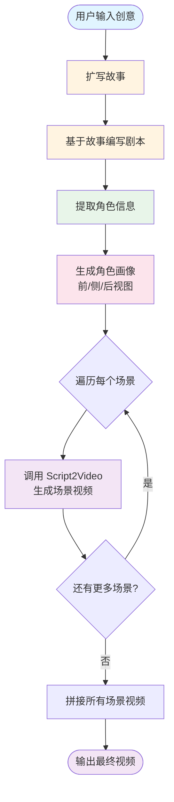
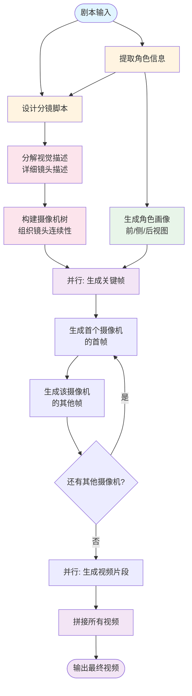
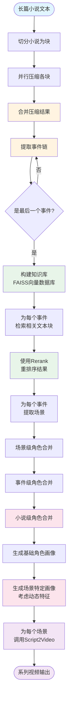
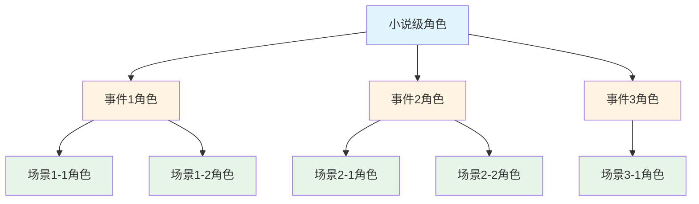
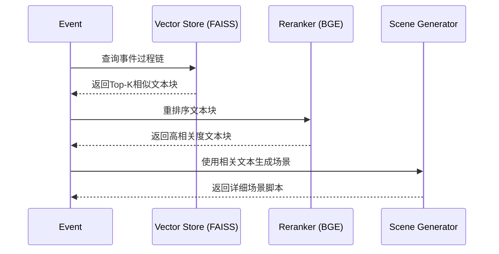

# 核心功能流水线

> 深入了解 ViMax 的三条核心流水线及其工作原理

## 目录

- [前置知识](#前置知识)
- [Idea2Video 流水线](#1-idea2video-创意到视频)
- [Script2Video 流水线](#2-script2video-剧本到视频)
- [Novel2Video 流水线](#3-novel2video-小说到视频)
- [相关资源](#相关资源)

## 前置知识

在阅读本文档之前，建议您先了解：

- [快速开始](./getting_started.md) - 了解如何配置和运行 ViMax
- [系统架构](./architecture.md) - 了解 ViMax 的整体架构设计
- [智能体详解](./agents.md) - 了解各个智能体的功能

---

ViMax 提供了三条核心流水线，分别应对不同的创作需求。

## 1. Idea2Video (创意到视频)

适用于从一个简单的点子或短文本快速生成视频。

### 适用场景
- 快速验证创意
- 制作短视频、预告片
- 社交媒体内容创作

### 工作流程概览

Idea2Video 流水线将简单的创意扩展为完整视频，主要分为四个阶段：

1. **创意扩写**: LLM 将用户的一句话创意扩写为完整的短故事
2. **剧本创作**: 基于故事编写结构化的场景剧本
3. **角色准备**: 提取角色信息并生成角色画像
4. **视频生成**: 调用 Script2Video 流水线逐场景生成视频

### 详细流程图



### 关键步骤说明

#### 1. 扩写故事 (develop_story)

**输入**:
- `idea`: 用户的简短创意描述
- `user_requirement`: 用户的具体需求（如时长、风格等）

**处理**:
- Screenwriter 智能体将创意扩展为完整的故事文本
- 补充情节细节、角色动机和场景描述

**输出**:
- 完整的故事文本（保存为 `story.txt`）

#### 2. 编写剧本 (write_script_based_on_story)

**输入**:
- 扩写后的故事文本
- 用户需求

**处理**:
- Screenwriter 智能体将故事转化为结构化剧本
- 划分场景，添加场景标题和动作描述

**输出**:
- 场景剧本列表（保存为 `script.json`）

#### 3. 提取角色 (extract_characters)

**输入**:
- 故事文本

**处理**:
- CharacterExtractor 智能体分析文本
- 识别所有角色及其特征

**输出**:
- 角色列表（保存为 `characters.json`）

#### 4. 生成角色画像 (generate_character_portraits)

**输入**:
- 角色列表
- 视觉风格

**处理**:
- CharacterPortraitsGenerator 为每个角色生成三视图
- 前视图、侧视图、后视图

**输出**:
- 角色画像注册表（保存为 `character_portraits_registry.json`）

#### 5. 场景视频生成

**输入**:
- 场景剧本
- 角色信息和画像

**处理**:
- 为每个场景创建独立的工作目录
- 调用 Script2Video 流水线生成场景视频

**输出**:
- 各场景的视频文件

#### 6. 视频拼接

**输入**:
- 所有场景的视频文件

**处理**:
- 使用 MoviePy 按顺序拼接视频

**输出**:
- 最终完整视频（`final_video.mp4`）

### 使用方法

配置 `configs/idea2video.yaml` 后，运行 `main_idea2video.py`。

```python
# main_idea2video.py
idea = "一个机器人在森林中发现了一朵发光的花"
style = "Cyberpunk"
user_requirement = "生成一个30秒的短视频，包含3-5个场景"
```

### 输出结构

```
working_dir/
├── story.txt                           # 扩写后的故事
├── script.json                         # 场景剧本列表
├── characters.json                     # 角色信息
├── character_portraits_registry.json   # 角色画像注册表
├── character_portraits/                # 角色画像目录
│   ├── 0_Robot/
│   │   ├── front.png
│   │   ├── side.png
│   │   └── back.png
│   └── ...
├── scene_0/                            # 第一个场景
│   └── final_video.mp4
├── scene_1/                            # 第二个场景
│   └── final_video.mp4
└── final_video.mp4                     # 最终拼接视频
```


---

## 2. Script2Video (剧本到视频)

适用于已有成熟剧本，需要将其视觉化的场景。

### 适用场景
- 影视从业者进行预演 (Pre-visualization)
- 广告片制作
- 动画短片制作

### 剧本格式

支持标准剧本格式，包含场景标题（Slugline）、动作描述（Action）和对话（Dialogue）。

```text
EXT. PARK - DAY
John sits on a bench, feeding pigeons.
```

### 工作流程概览

Script2Video 是 ViMax 的核心流水线，负责将剧本转换为视频。主要分为六个阶段：

1. **角色提取与画像生成**: 识别剧本中的角色并生成标准画像
2. **分镜设计**: 将剧本转化为详细的分镜脚本
3. **视觉描述分解**: 为每个镜头生成详细的视觉描述
4. **摄像机树构建**: 组织镜头之间的连续性关系
5. **关键帧生成**: 并行生成所有镜头的关键帧图像
6. **视频生成与拼接**: 基于关键帧生成视频并拼接


### 详细流程图




### 关键步骤说明

#### 1. 提取角色 (extract_characters)

**输入**:
- 剧本文本

**处理**:
- CharacterExtractor 智能体分析剧本
- 提取角色的静态特征（外貌、服装等）

**输出**:
- 角色列表（`characters.json`）

#### 2. 生成角色画像 (generate_character_portraits)

**输入**:
- 角色列表
- 视觉风格

**处理**:
- CharacterPortraitsGenerator 为每个角色生成三个视角的画像
- 前视图、侧视图、后视图
- 这些画像将作为后续生成的参考图

**输出**:
- 角色画像注册表（`character_portraits_registry.json`）
- 画像图片文件（`character_portraits/` 目录）

#### 3. 设计分镜 (design_storyboard)

**输入**:
- 剧本文本
- 角色列表
- 用户需求

**处理**:
- StoryboardArtist 智能体将剧本转化为分镜脚本
- 为每个镜头分配摄像机索引
- 生成简要的视觉和音频描述

**输出**:
- 分镜简要描述列表（`storyboard.json`）


#### 4. 分解视觉描述 (decompose_visual_descriptions)

**输入**:
- 分镜简要描述列表
- 角色列表

**处理**:
- StoryboardArtist 为每个镜头生成详细描述
- 包括首帧描述、末帧描述、运动描述
- 标注可见角色和变化程度

**输出**:
- 详细镜头描述列表（每个镜头的 `shot_description.json`）

#### 5. 构建摄像机树 (construct_camera_tree)

**输入**:
- 详细镜头描述列表

**处理**:
- CameraImageGenerator 分析镜头之间的关系
- 将使用相同摄像机位置的镜头分组
- 建立父子关系以优化生成顺序

**输出**:
- 摄像机树结构（`camera_tree.json`）

**摄像机树的作用**:
- 提高角色和场景的一致性
- 优化关键帧生成顺序
- 支持镜头转场视频生成


#### 6. 生成关键帧 (generate_frames_for_single_camera)

这是最复杂的步骤，采用智能的生成策略：

**对于每个摄像机**:

1. **生成首个镜头的首帧**:
   - 如果有父摄像机：生成转场视频，提取新摄像机的首帧
   - 否则：选择参考图像（角色画像），生成首帧

2. **生成该摄像机的其他帧**:
   - 优先生成作为其他摄像机父镜头的帧（priority_tasks）
   - 然后生成普通帧（normal_tasks）
   - 对于变化较大的镜头，生成末帧

**参考图像选择**:
- ReferenceImageSelector 智能选择最合适的参考图
- 包括角色画像和之前生成的关键帧
- 生成优化的提示词

**输出**:
- 每个镜头的关键帧图像（`shots/{idx}/first_frame.png`, `last_frame.png`）

#### 7. 生成视频 (generate_video_for_single_shot)

**输入**:
- 镜头的关键帧图像
- 运动描述和音频描述

**处理**:
- 等待关键帧生成完成（使用 asyncio.Event 同步）
- 调用 VideoGenerator 基于关键帧生成视频
- 支持单帧或双帧（首帧+末帧）生成

**输出**:
- 镜头视频文件（`shots/{idx}/video.mp4`）

#### 8. 拼接视频

**输入**:
- 所有镜头的视频文件

**处理**:
- 使用 MoviePy 按镜头顺序拼接

**输出**:
- 最终完整视频（`final_video.mp4`）


### 并行处理机制

Script2Video 充分利用 Python 的 asyncio 实现并行处理：

```mermaid
gantt
    title Script2Video 并行处理时间线
    dateFormat X
    axisFormat %s
    
    section 角色准备
    提取角色           :0, 10
    生成角色画像       :10, 30
    
    section 分镜设计
    设计分镜脚本       :10, 25
    分解视觉描述       :25, 40
    构建摄像机树       :40, 45
    
    section 关键帧生成
    摄像机1-首帧       :45, 55
    摄像机1-其他帧     :55, 70
    摄像机2-首帧       :55, 65
    摄像机2-其他帧     :65, 80
    摄像机3-首帧       :65, 75
    摄像机3-其他帧     :75, 90
    
    section 视频生成
    镜头1视频          :55, 75
    镜头2视频          :65, 85
    镜头3视频          :75, 95
    镜头4视频          :80, 100
    
    section 后处理
    拼接视频           :100, 105
```



**并行策略**:
- 角色画像生成：多个角色并行生成
- 视觉描述分解：多个镜头并行处理
- 关键帧生成：多个摄像机并行，但保持依赖关系
- 视频生成：所有镜头并行生成

### 使用方法

配置 `configs/script2video.yaml` 后，运行 `main_script2video.py`。

```python
# main_script2video.py
script = """
EXT. FOREST - DAY
A robot walks through a dense forest, its sensors scanning the environment.

The robot stops suddenly, detecting an unusual energy signature.

It approaches a clearing where a glowing flower emits a soft blue light.
"""
style = "Cyberpunk"
user_requirement = "生成一个高质量的视频，注重细节和氛围"
```


### 输出结构

```
working_dir/
├── characters.json                     # 角色信息
├── character_portraits_registry.json   # 角色画像注册表
├── character_portraits/                # 角色画像目录
│   ├── 0_Robot/
│   │   ├── front.png
│   │   ├── side.png
│   │   └── back.png
│   └── ...
├── storyboard.json                     # 分镜简要描述
├── camera_tree.json                    # 摄像机树结构
├── shots/                              # 镜头目录
│   ├── 0/
│   │   ├── shot_description.json       # 详细镜头描述
│   │   ├── first_frame.png             # 首帧
│   │   ├── last_frame.png              # 末帧（如果需要）
│   │   ├── first_frame_selector_output.json  # 参考图选择结果
│   │   ├── video.mp4                   # 镜头视频
│   │   └── transition_video_from_shot_X.mp4  # 转场视频（如果有）
│   ├── 1/
│   │   └── ...
│   └── ...
└── final_video.mp4                     # 最终拼接视频
```

---

## 3. Novel2Video (小说到视频)

> [!WARNING]
> **实验性功能**: 该流水线目前处于开发阶段 (`TODO: NOT IMPLEMENTED YET`)，可能包含未完成的功能或不稳定特性。

**（实验性功能）** 适用于将长篇小说改编为系列视频。

### 适用场景
- 长篇小说可视化
- 文学作品改编
- 系列视频制作

### 核心特性
- **长文本处理**: 自动压缩和摘要长篇小说
- **事件驱动**: 基于事件（Event）而非简单的文本切分来组织视频结构
- **角色一致性**: 具备跨越多个场景和事件的角色外观保持能力
- **RAG 检索**: 使用检索增强生成技术回溯原文细节


### 工作流程概览

Novel2Video 是最复杂的流水线，主要分为七个阶段：

1. **小说压缩**: 将长篇小说压缩为核心信息
2. **事件提取**: 从压缩文本中提取关键事件链
3. **知识检索**: 为每个事件检索原文细节（RAG）
4. **场景提取**: 将事件转化为具体场景脚本
5. **角色合并**: 从场景级到事件级再到小说级合并角色信息
6. **画像生成**: 生成基础画像和场景特定画像
7. **视频生成**: 调用 Script2Video 逐场景生成视频

### 详细流程图




### 关键步骤说明

#### 1. 小说压缩 (Novel Compression)

**输入**:
- 长篇小说文本（可能数十万字）

**处理**:
- NovelCompressor 将小说切分为多个块
- 并行压缩每个块，保留核心情节和关键细节
- 合并压缩结果

**输出**:
- 压缩后的小说文本（`novel_compressed.txt`）
- 压缩比通常在 20-40%

#### 2. 事件提取 (Event Extraction)

**输入**:
- 压缩后的小说文本

**处理**:
- EventExtractor 迭代提取关键事件
- 每个事件包含：标题、过程链、角色、时间、地点
- 直到提取到标记为 `is_last=True` 的事件

**输出**:
- 事件列表（`events/event_0.json`, `event_1.json`, ...）

#### 3. 知识检索 (Knowledge Retrieval - RAG)

**输入**:
- 原始小说文本
- 提取的事件列表

**处理**:
- 使用 RecursiveCharacterTextSplitter 切分原文
- 使用 FAISS 构建向量数据库
- 为每个事件的过程链检索相关文本块
- 使用 BGE Rerank 模型重排序，筛选高相关度文本

**输出**:
- 每个事件的相关文本块（`relevant_chunks/event_{idx}/`）

**为什么需要 RAG**:
- 压缩过程会丢失细节描写
- RAG 可以为每个事件回溯原文中的具体描述
- 提高生成视频的细节丰富度


#### 4. 场景提取 (Scene Extraction)

**输入**:
- 事件信息
- 相关文本块

**处理**:
- SceneExtractor 将每个事件分解为多个场景
- 每个场景包含：剧本、角色、环境信息
- 迭代提取直到 `is_last=True`

**输出**:
- 场景列表（`scenes/event_{idx}/scene_0.json`, ...）

#### 5. 角色合并 (Character Merging)

这是 Novel2Video 的创新设计，采用三级角色管理：

**场景级 → 事件级**:
- GlobalInformationPlanner 合并同一事件中不同场景的角色
- 统一角色标识符和特征描述

**事件级 → 小说级**:
- 跨事件合并角色信息
- 追踪角色在不同事件中的出现
- 维护角色的静态特征一致性

**输出**:
- 事件级角色信息（`global_information/characters/event_level/`）
- 小说级角色信息（`global_information/characters/novel_level/`）

#### 6. 画像生成 (Portrait Generation)

**基础画像**:
- 基于角色的静态特征生成标准画像
- 全身、正面、白色背景

**场景特定画像**:
- 考虑动态特征（如受伤、换装、情绪）
- 基于基础画像进行修改
- 如果角色不可见或无动态特征，复用基础画像

**输出**:
- 基础画像（`character_portraits/base/`）
- 场景特定画像（`character_portraits/event_{idx}/scene_{idx}/`）


#### 7. 视频生成 (Video Generation)

**输入**:
- 场景剧本
- 场景特定的角色画像

**处理**:
- 为每个场景调用 Script2Video 流水线
- 使用场景特定的角色画像作为参考

**输出**:
- 每个场景的视频（`videos/event_{idx}/scene_{idx}/final_video.mp4`）

### 技术亮点

#### 1. 分层角色管理



#### 2. RAG 检索流程




### 配置要求

Novel2Video 需要额外的配置：

```yaml
# 向量数据库配置
embeddings:
  model: "text-embedding-3-small"
  
# Rerank 模型配置
reranker:
  class_path: "tools.reranker_bge_silicon_api.RerankerBgeSiliconapi"
  init_args:
    api_key: "your_api_key"
```

### 注意事项

1. **计算资源**: Novel2Video 消耗大量计算资源和 API 调用
2. **Token 消耗**: 长篇小说可能消耗数百万 tokens
3. **时间成本**: 完整流程可能需要数小时甚至数天
4. **存储空间**: 生成的中间文件和视频需要大量存储空间

### 输出结构

```
working_dir/
├── novel/
│   ├── novel.txt                       # 原始小说
│   ├── novel_chunk_*.txt               # 小说分块
│   ├── novel_chunk_*_compressed.txt    # 压缩后的分块
│   └── novel_compressed.txt            # 合并的压缩文本
├── events/
│   ├── event_0.json
│   ├── event_1.json
│   └── ...
├── knowledge_base/                     # FAISS 向量数据库
├── relevant_chunks/                    # 检索到的相关文本
│   ├── event_0/
│   │   ├── chunk_0-score_0.85.txt
│   │   └── ...
│   └── ...
├── scenes/
│   ├── event_0/
│   │   ├── scene_0.json
│   │   └── ...
│   └── ...
├── global_information/
│   └── characters/
│       ├── event_level/
│       │   ├── event_0_characters.json
│       │   └── ...
│       └── novel_level/
│           └── novel_characters_after_event_*.json
├── character_portraits/
│   ├── base/                           # 基础画像
│   │   ├── character_0_Name.png
│   │   └── ...
│   ├── event_0/                        # 场景特定画像
│   │   ├── scene_0/
│   │   │   ├── character_0_Name.png
│   │   │   └── ...
│   │   └── ...
│   └── ...
└── videos/
    ├── event_0/
    │   ├── scene_0/
    │   │   └── final_video.mp4
    │   └── ...
    └── ...
```

---

## 相关资源

### 深入学习

- **[系统架构](./architecture.md)** - 了解流水线的底层架构设计
- **[智能体详解](./agents.md)** - 了解流水线中使用的各个智能体
- **[工具与集成](./tools.md)** - 了解如何配置图像和视频生成工具
- **[配置详解](./configuration.md)** - 了解流水线的配置选项
- **[示例与最佳实践](./examples.md)** - 查看完整的使用示例

### 性能优化建议

1. **Idea2Video**:
   - 控制场景数量（3-5个为宜）
   - 使用简洁的创意描述
   - 合理设置用户需求

2. **Script2Video**:
   - 控制镜头数量（10-20个为宜）
   - 优化剧本结构，减少不必要的场景切换
   - 复用角色画像

3. **Novel2Video**:
   - 选择关键章节而非全文
   - 调整压缩比例
   - 使用更快的 embedding 模型
   - 批量处理场景

### 常见问题

**Q: 三个流水线应该如何选择？**

A: 
- 如果只有一个简单的点子 → 使用 Idea2Video
- 如果已有完整剧本 → 使用 Script2Video
- 如果要改编长篇小说 → 使用 Novel2Video（实验性）

**Q: 可以自定义流水线吗？**

A: 可以。ViMax 的模块化设计允许您：
- 继承现有流水线类并重写方法
- 组合不同的智能体创建新流水线
- 参考 [开发指南](./development.md) 了解详情

**Q: 如何提高生成速度？**

A: 
- 使用更快的 API 服务
- 减少镜头数量
- 启用缓存机制（默认已启用）
- 使用更强大的硬件

**Q: 生成的视频质量不理想怎么办？**

A: 
- 优化提示词和用户需求
- 调整视觉风格参数
- 使用更高质量的图像/视频生成模型
- 参考 [故障排查](./troubleshooting.md)

---

**下一步**: 阅读 [智能体详解](./agents.md) 了解流水线中使用的各个智能体，或查看 [示例与最佳实践](./examples.md) 学习如何使用流水线。
