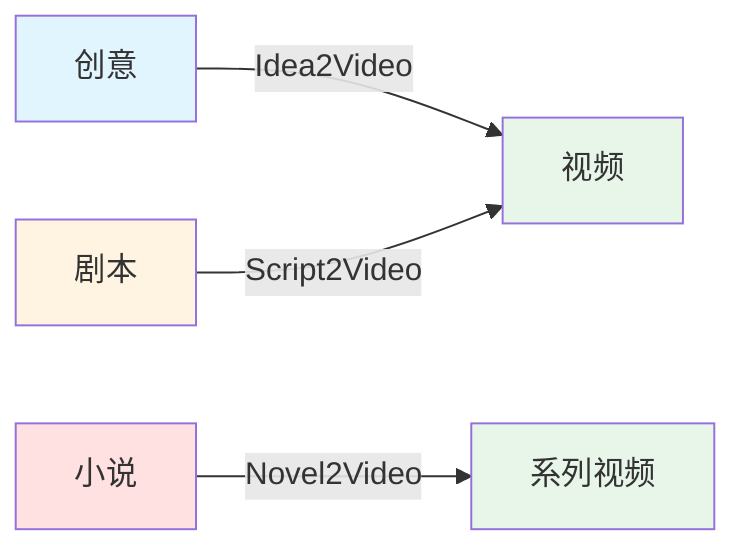
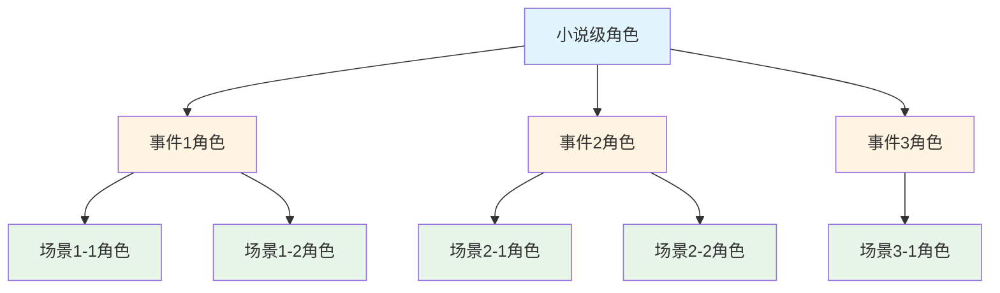
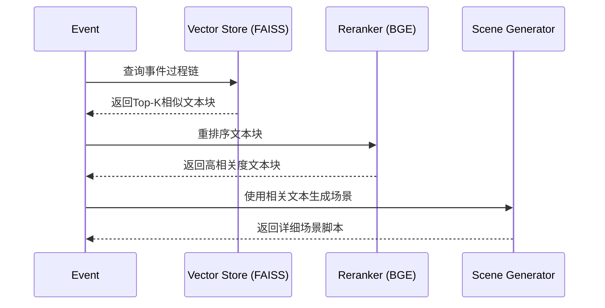

# 核心功能流水线

> 深入了解 ViMax 的三条核心流水线及其工作原理

## 目录

- [前置知识](#前置知识)
- [Idea2Video 流水线](#1-idea2video-创意到视频)
- [Script2Video 流水线](#2-script2video-剧本到视频)
- [Novel2Video 流水线](#3-novel2video-小说到视频)
- [相关资源](#相关资源)

## 前置知识

在阅读本文档之前，建议您先了解：

- [快速开始](./getting_started.md) - 了解如何配置和运行 ViMax
- [系统架构](./architecture.md) - 了解 ViMax 的整体架构设计
- [智能体详解](./agents.md) - 了解各个智能体的功能

---

## 流水线概览

ViMax 提供了三条核心流水线，分别应对不同的创作需求：

| 流水线 | 输入 | 输出 | 适用场景 | 状态 |
|--------|------|------|----------|------|
| **Idea2Video** | 简短创意（1-3句话） | 完整视频 | 快速验证创意、短视频制作 | ✅ 稳定 |
| **Script2Video** | 完整剧本 | 完整视频 | 影视预演、广告制作 | ✅ 稳定 |
| **Novel2Video** | 长篇小说文本 | 系列视频 | 文学作品改编 | ⚠️ 实验性 |

### 快速对比



**选择建议**:
- 💡 **有创意，没剧本** → Idea2Video
- 📝 **有剧本，要视觉化** → Script2Video  
- 📚 **有小说，要改编** → Novel2Video（实验性）

---

## 端到端示例

在深入了解每个流水线之前，先看几个完整的使用示例：

### 示例 1: 使用 Idea2Video 快速生成短视频

```python
import asyncio
from pipelines.idea2video_pipeline import Idea2VideoPipeline

async def quick_video_from_idea():
    """从一个简单的创意生成30秒短视频"""
    
    # 1. 初始化流水线
    pipeline = Idea2VideoPipeline.init_from_config("configs/idea2video.yaml")
    
    # 2. 定义创意（简短即可）
    idea = "一只猫咪宇航员在月球上发现了一个神秘的水晶"
    
    # 3. 定义需求
    user_requirement = """
    - 场景数量: 3个
    - 视频时长: 30秒
    - 视觉风格: 科幻，太空歌剧风格
    - 重点: 突出猫咪的可爱和水晶的神秘感
    """
    
    # 4. 定义风格
    style = "Sci-fi, space opera, cinematic lighting, detailed"
    
    # 5. 生成视频
    print("开始生成视频...")
    video_path = await pipeline(idea, user_requirement, style)
    print(f"✅ 视频生成完成: {video_path}")
    
    return video_path

# 运行
asyncio.run(quick_video_from_idea())
```

**预期输出**:
- 故事扩写: 将创意扩展为包含3个场景的完整故事
- 角色提取: 识别"猫咪宇航员"角色
- 角色画像: 生成猫咪宇航员的三视图
- 场景视频: 为每个场景生成10-20秒的视频
- 最终视频: 拼接所有场景，总时长约30秒

### 示例 2: 使用 Script2Video 从剧本生成视频

```python
import asyncio
from pipelines.script2video_pipeline import Script2VideoPipeline

async def video_from_script():
    """从完整剧本生成高质量视频"""
    
    # 1. 初始化流水线
    pipeline = Script2VideoPipeline.init_from_config("configs/script2video.yaml")
    
    # 2. 准备剧本（标准格式）
    script = """
EXT. MOON SURFACE - NIGHT
The lunar landscape stretches endlessly under a starry sky.

A CAT ASTRONAUT (orange tabby, wearing a white spacesuit) bounces across the surface.
Its helmet visor reflects the Earth in the distance.

The cat stops suddenly, its ears perking up inside the helmet.

In front of it, a GLOWING CRYSTAL emerges from the lunar dust.
The crystal pulses with an ethereal blue light.

The cat approaches cautiously, extending a paw toward the crystal.

As the paw touches the crystal, a burst of light illuminates the entire scene.
"""
    
    # 3. 定义需求
    user_requirement = """
    - 镜头风格: 电影级，使用广角和特写交替
    - 光影: 强调星光和水晶的发光效果
    - 节奏: 缓慢而富有张力
    - 重点镜头: 猫咪触碰水晶的特写
    """
    
    # 4. 定义风格
    style = "Cinematic sci-fi, Interstellar style, realistic, detailed textures"
    
    # 5. 生成视频
    print("开始生成视频...")
    video_path = await pipeline(script, user_requirement, style)
    print(f"✅ 视频生成完成: {video_path}")
    
    return video_path

# 运行
asyncio.run(video_from_script())
```

**预期输出**:
- 角色提取: 识别"猫咪宇航员"和"发光水晶"
- 分镜设计: 将剧本转化为8-12个镜头
- 关键帧生成: 为每个镜头生成首帧（和末帧）
- 视频生成: 基于关键帧生成每个镜头的视频
- 最终视频: 拼接所有镜头，总时长约40-60秒

### 示例 3: 复用角色画像提高效率

```python
import asyncio
import json
from pipelines.script2video_pipeline import Script2VideoPipeline
from interfaces import CharacterInScene

async def reuse_character_portraits():
    """在多个场景中复用相同的角色画像"""
    
    pipeline = Script2VideoPipeline.init_from_config("configs/script2video.yaml")
    
    # 场景1: 猫咪在月球
    script1 = """
EXT. MOON SURFACE - NIGHT
A cat astronaut explores the lunar surface.
"""
    
    video1 = await pipeline(
        script=script1,
        user_requirement="科幻风格",
        style="Sci-fi, cinematic",
    )
    print(f"场景1完成: {video1}")
    
    # 保存角色信息
    with open(f"{pipeline.working_dir}/characters.json", "r") as f:
        characters_data = json.load(f)
    characters = [CharacterInScene.model_validate(c) for c in characters_data]
    
    with open(f"{pipeline.working_dir}/character_portraits_registry.json", "r") as f:
        portraits = json.load(f)
    
    # 场景2: 猫咪在空间站（复用角色）
    pipeline.working_dir = ".working_dir/script2video_scene2"
    script2 = """
INT. SPACE STATION - DAY
The cat astronaut floats in zero gravity, examining the crystal.
"""
    
    video2 = await pipeline(
        script=script2,
        user_requirement="科幻风格",
        style="Sci-fi, cinematic",
        characters=characters,  # 复用角色信息
        character_portraits_registry=portraits,  # 复用画像
    )
    print(f"场景2完成: {video2}")
    print("✅ 两个场景的角色保持一致！")

# 运行
asyncio.run(reuse_character_portraits())
```

**优势**:
- 节省时间: 跳过角色画像生成步骤
- 保持一致性: 确保角色在不同场景中外观一致
- 降低成本: 减少图像生成 API 调用

---

## 1. Idea2Video (创意到视频)

适用于从一个简单的点子或短文本快速生成视频。

### 适用场景
- 快速验证创意
- 制作短视频、预告片
- 社交媒体内容创作

### 工作流程概览

Idea2Video 流水线将简单的创意扩展为完整视频，主要分为四个阶段：

1. **创意扩写**: LLM 将用户的一句话创意扩写为完整的短故事
2. **剧本创作**: 基于故事编写结构化的场景剧本
3. **角色准备**: 提取角色信息并生成角色画像
4. **视频生成**: 调用 Script2Video 流水线逐场景生成视频

### 详细流程图


### 关键步骤说明

#### 1. 扩写故事 (develop_story)

**输入**:
- `idea`: 用户的简短创意描述
- `user_requirement`: 用户的具体需求（如时长、风格等）

**处理**:
- Screenwriter 智能体将创意扩展为完整的故事文本
- 补充情节细节、角色动机和场景描述

**输出**:
- 完整的故事文本（保存为 `story.txt`）

#### 2. 编写剧本 (write_script_based_on_story)

**输入**:
- 扩写后的故事文本
- 用户需求

**处理**:
- Screenwriter 智能体将故事转化为结构化剧本
- 划分场景，添加场景标题和动作描述

**输出**:
- 场景剧本列表（保存为 `script.json`）

#### 3. 提取角色 (extract_characters)

**输入**:
- 故事文本

**处理**:
- CharacterExtractor 智能体分析文本
- 识别所有角色及其特征

**输出**:
- 角色列表（保存为 `characters.json`）

#### 4. 生成角色画像 (generate_character_portraits)

**输入**:
- 角色列表
- 视觉风格

**处理**:
- CharacterPortraitsGenerator 为每个角色生成三视图
- 前视图、侧视图、后视图

**输出**:
- 角色画像注册表（保存为 `character_portraits_registry.json`）

#### 5. 场景视频生成

**输入**:
- 场景剧本
- 角色信息和画像

**处理**:
- 为每个场景创建独立的工作目录
- 调用 Script2Video 流水线生成场景视频

**输出**:
- 各场景的视频文件

#### 6. 视频拼接

**输入**:
- 所有场景的视频文件

**处理**:
- 使用 MoviePy 按顺序拼接视频

**输出**:
- 最终完整视频（`final_video.mp4`）

### 配置选项

Idea2Video 流水线通过 `configs/idea2video.yaml` 进行配置：

```yaml
# 聊天模型配置（用于智能体）
chat_model:
  init_args:
    model: google/gemini-2.5-flash-lite-preview-09-2025  # 模型名称
    model_provider: openai                                # 提供商
    api_key: your_api_key                                 # API密钥
    base_url: https://openrouter.ai/api/v1               # API端点

# 图像生成器配置
image_generator:
  class_path: tools.ImageGeneratorNanobananaGoogleAPI    # 生成器类路径
  init_args:
    api_key: your_api_key                                # API密钥

# 视频生成器配置
video_generator:
  class_path: tools.VideoGeneratorVeoGoogleAPI           # 生成器类路径
  init_args:
    api_key: your_api_key                                # API密钥

# 工作目录（存储中间文件和输出）
working_dir: .working_dir/idea2video
```

**关键参数说明**:

| 参数 | 说明 | 默认值 | 建议 |
|------|------|--------|------|
| `chat_model.model` | LLM 模型名称 | gemini-2.5-flash-lite | 使用支持长上下文的模型 |
| `image_generator.class_path` | 图像生成工具类 | ImageGeneratorNanobananaGoogleAPI | 根据需求选择工具 |
| `video_generator.class_path` | 视频生成工具类 | VideoGeneratorVeoGoogleAPI | 根据需求选择工具 |
| `working_dir` | 工作目录路径 | .working_dir/idea2video | 确保有足够存储空间 |

### 使用方法

#### 基本使用

配置 `configs/idea2video.yaml` 后，运行 `main_idea2video.py`：

```python
# main_idea2video.py
import asyncio
from pipelines.idea2video_pipeline import Idea2VideoPipeline

async def main():
    # 从配置文件初始化流水线
    pipeline = Idea2VideoPipeline.init_from_config(
        config_path="configs/idea2video.yaml"
    )
    
    # 定义创意和需求
    idea = "一个机器人在森林中发现了一朵发光的花"
    style = "Cyberpunk"
    user_requirement = "生成一个30秒的短视频，包含3-5个场景"
    
    # 执行流水线
    final_video_path = await pipeline(
        idea=idea,
        user_requirement=user_requirement,
        style=style,
    )
    
    print(f"视频生成完成: {final_video_path}")

if __name__ == "__main__":
    asyncio.run(main())
```

#### 高级使用：手动初始化

如果需要更细粒度的控制，可以手动初始化流水线：

```python
from pipelines.idea2video_pipeline import Idea2VideoPipeline
from langchain.chat_models import init_chat_model
from tools import ImageGeneratorNanobananaGoogleAPI, VideoGeneratorVeoGoogleAPI

# 手动初始化各组件
chat_model = init_chat_model(
    model="google/gemini-2.5-flash-lite-preview-09-2025",
    model_provider="openai",
    api_key="your_api_key",
    base_url="https://openrouter.ai/api/v1"
)

image_generator = ImageGeneratorNanobananaGoogleAPI(api_key="your_api_key")
video_generator = VideoGeneratorVeoGoogleAPI(api_key="your_api_key")

# 创建流水线实例
pipeline = Idea2VideoPipeline(
    chat_model=chat_model,
    image_generator=image_generator,
    video_generator=video_generator,
    working_dir=".working_dir/idea2video",
)

# 执行流水线
final_video_path = await pipeline(
    idea="你的创意",
    user_requirement="你的需求",
    style="视觉风格",
)
```

### 输入输出详解

#### 输入参数

| 参数 | 类型 | 必需 | 说明 | 示例 |
|------|------|------|------|------|
| `idea` | str | 是 | 简短的创意描述 | "机器人发现神秘植物" |
| `user_requirement` | str | 是 | 用户的具体需求 | "生成3个场景，30秒，赛博朋克风格" |
| `style` | str | 是 | 视觉风格描述 | "Cyberpunk, neon lights" |

#### 输出结果

**返回值**: `str` - 最终视频文件的路径

**输出文件结构**:

```
working_dir/
├── story.txt                           # 扩写后的故事文本
├── script.json                         # 场景剧本列表（JSON格式）
├── characters.json                     # 角色信息列表
├── character_portraits_registry.json   # 角色画像注册表
├── character_portraits/                # 角色画像目录
│   ├── 0_Robot/                        # 角色索引_角色名
│   │   ├── front.png                   # 前视图（1024x1024）
│   │   ├── side.png                    # 侧视图（1024x1024）
│   │   └── back.png                    # 后视图（1024x1024）
│   └── 1_Vendor/
│       ├── front.png
│       ├── side.png
│       └── back.png
├── scene_0/                            # 第一个场景的工作目录
│   ├── characters.json                 # 该场景的角色信息
│   ├── storyboard.json                 # 该场景的分镜脚本
│   ├── camera_tree.json                # 该场景的摄像机树
│   ├── shots/                          # 镜头目录
│   │   ├── 0/
│   │   │   ├── shot_description.json
│   │   │   ├── first_frame.png
│   │   │   └── video.mp4
│   │   └── ...
│   └── final_video.mp4                 # 该场景的最终视频
├── scene_1/                            # 第二个场景
│   └── ...
└── final_video.mp4                     # 所有场景拼接后的最终视频
```

**关键文件说明**:

- `story.txt`: 由 Screenwriter 扩写的完整故事，包含情节、角色和场景描述
- `script.json`: 结构化的场景剧本，每个场景包含标题和动作描述
- `characters.json`: 提取的角色列表，包含角色索引、名称和特征描述
- `character_portraits_registry.json`: 角色画像的路径和描述信息
- `final_video.mp4`: 最终输出的完整视频文件（MP4格式，H.264编码）


---

## 2. Script2Video (剧本到视频)

适用于已有成熟剧本，需要将其视觉化的场景。

### 适用场景
- 影视从业者进行预演 (Pre-visualization)
- 广告片制作
- 动画短片制作

### 剧本格式

支持标准剧本格式，包含场景标题（Slugline）、动作描述（Action）和对话（Dialogue）。

```text
EXT. PARK - DAY
John sits on a bench, feeding pigeons.
```

### 工作流程概览

Script2Video 是 ViMax 的核心流水线，负责将剧本转换为视频。主要分为六个阶段：

1. **角色提取与画像生成**: 识别剧本中的角色并生成标准画像
2. **分镜设计**: 将剧本转化为详细的分镜脚本
3. **视觉描述分解**: 为每个镜头生成详细的视觉描述
4. **摄像机树构建**: 组织镜头之间的连续性关系
5. **关键帧生成**: 并行生成所有镜头的关键帧图像
6. **视频生成与拼接**: 基于关键帧生成视频并拼接


### 详细流程图


### 关键步骤说明

#### 1. 提取角色 (extract_characters)

**输入**:
- 剧本文本

**处理**:
- CharacterExtractor 智能体分析剧本
- 提取角色的静态特征（外貌、服装等）

**输出**:
- 角色列表（`characters.json`）

#### 2. 生成角色画像 (generate_character_portraits)

**输入**:
- 角色列表
- 视觉风格

**处理**:
- CharacterPortraitsGenerator 为每个角色生成三个视角的画像
- 前视图、侧视图、后视图
- 这些画像将作为后续生成的参考图

**输出**:
- 角色画像注册表（`character_portraits_registry.json`）
- 画像图片文件（`character_portraits/` 目录）

#### 3. 设计分镜 (design_storyboard)

**输入**:
- 剧本文本
- 角色列表
- 用户需求

**处理**:
- StoryboardArtist 智能体将剧本转化为分镜脚本
- 为每个镜头分配摄像机索引
- 生成简要的视觉和音频描述

**输出**:
- 分镜简要描述列表（`storyboard.json`）


#### 4. 分解视觉描述 (decompose_visual_descriptions)

**输入**:
- 分镜简要描述列表
- 角色列表

**处理**:
- StoryboardArtist 为每个镜头生成详细描述
- 包括首帧描述、末帧描述、运动描述
- 标注可见角色和变化程度

**输出**:
- 详细镜头描述列表（每个镜头的 `shot_description.json`）

#### 5. 构建摄像机树 (construct_camera_tree)

**输入**:
- 详细镜头描述列表

**处理**:
- CameraImageGenerator 分析镜头之间的关系
- 将使用相同摄像机位置的镜头分组
- 建立父子关系以优化生成顺序

**输出**:
- 摄像机树结构（`camera_tree.json`）

**摄像机树的作用**:
- 提高角色和场景的一致性
- 优化关键帧生成顺序
- 支持镜头转场视频生成


#### 6. 生成关键帧 (generate_frames_for_single_camera)

这是最复杂的步骤，采用智能的生成策略：

**对于每个摄像机**:

1. **生成首个镜头的首帧**:
   - 如果有父摄像机：生成转场视频，提取新摄像机的首帧
   - 否则：选择参考图像（角色画像），生成首帧

2. **生成该摄像机的其他帧**:
   - 优先生成作为其他摄像机父镜头的帧（priority_tasks）
   - 然后生成普通帧（normal_tasks）
   - 对于变化较大的镜头，生成末帧

**参考图像选择**:
- ReferenceImageSelector 智能选择最合适的参考图
- 包括角色画像和之前生成的关键帧
- 生成优化的提示词

**输出**:
- 每个镜头的关键帧图像（`shots/{idx}/first_frame.png`, `last_frame.png`）

#### 7. 生成视频 (generate_video_for_single_shot)

**输入**:
- 镜头的关键帧图像
- 运动描述和音频描述

**处理**:
- 等待关键帧生成完成（使用 asyncio.Event 同步）
- 调用 VideoGenerator 基于关键帧生成视频
- 支持单帧或双帧（首帧+末帧）生成

**输出**:
- 镜头视频文件（`shots/{idx}/video.mp4`）

#### 8. 拼接视频

**输入**:
- 所有镜头的视频文件

**处理**:
- 使用 MoviePy 按镜头顺序拼接

**输出**:
- 最终完整视频（`final_video.mp4`）


### 并行处理机制

Script2Video 充分利用 Python 的 asyncio 实现并行处理：

```mermaid
gantt
    title Script2Video 并行处理时间线
    dateFormat X
    axisFormat %s
    
    section 角色准备
    提取角色           :0, 10
    生成角色画像       :10, 30
    
    section 分镜设计
    设计分镜脚本       :10, 25
    分解视觉描述       :25, 40
    构建摄像机树       :40, 45
    
    section 关键帧生成
    摄像机1-首帧       :45, 55
    摄像机1-其他帧     :55, 70
    摄像机2-首帧       :55, 65
    摄像机2-其他帧     :65, 80
    摄像机3-首帧       :65, 75
    摄像机3-其他帧     :75, 90
    
    section 视频生成
    镜头1视频          :55, 75
    镜头2视频          :65, 85
    镜头3视频          :75, 95
    镜头4视频          :80, 100
    
    section 后处理
    拼接视频           :100, 105
```



**并行策略**:
- 角色画像生成：多个角色并行生成
- 视觉描述分解：多个镜头并行处理
- 关键帧生成：多个摄像机并行，但保持依赖关系
- 视频生成：所有镜头并行生成

### 配置选项

Script2Video 流水线通过 `configs/script2video.yaml` 进行配置：

```yaml
# 聊天模型配置（用于智能体）
chat_model:
  init_args:
    model: google/gemini-2.5-flash-lite-preview-09-2025  # 模型名称
    model_provider: openai                                # 提供商
    api_key: your_api_key                                 # API密钥
    base_url: https://openrouter.ai/api/v1               # API端点

# 图像生成器配置
image_generator:
  class_path: tools.ImageGeneratorNanobananaGoogleAPI    # 生成器类路径
  init_args:
    api_key: your_api_key                                # API密钥

# 视频生成器配置
video_generator:
  class_path: tools.VideoGeneratorVeoGoogleAPI           # 生成器类路径
  init_args:
    api_key: your_api_key                                # API密钥

# 工作目录（存储中间文件和输出）
working_dir: .working_dir/script2video
```

**关键参数说明**:

| 参数 | 说明 | 默认值 | 建议 |
|------|------|--------|------|
| `chat_model.model` | LLM 模型名称 | gemini-2.5-flash-lite | 使用支持视觉理解的模型 |
| `image_generator.class_path` | 图像生成工具类 | ImageGeneratorNanobananaGoogleAPI | 选择支持参考图的工具 |
| `video_generator.class_path` | 视频生成工具类 | VideoGeneratorVeoGoogleAPI | 选择支持关键帧的工具 |
| `working_dir` | 工作目录路径 | .working_dir/script2video | 确保有足够存储空间 |

### 使用方法

#### 基本使用

配置 `configs/script2video.yaml` 后，运行 `main_script2video.py`：

```python
# main_script2video.py
import asyncio
from pipelines.script2video_pipeline import Script2VideoPipeline

async def main():
    # 从配置文件初始化流水线
    pipeline = Script2VideoPipeline.init_from_config(
        config_path="configs/script2video.yaml"
    )
    
    # 定义剧本
    script = """
EXT. FOREST - DAY
A robot walks through a dense forest, its sensors scanning the environment.

The robot stops suddenly, detecting an unusual energy signature.

It approaches a clearing where a glowing flower emits a soft blue light.
"""
    
    style = "Cyberpunk"
    user_requirement = "生成一个高质量的视频，注重细节和氛围"
    
    # 执行流水线
    final_video_path = await pipeline(
        script=script,
        user_requirement=user_requirement,
        style=style,
    )
    
    print(f"视频生成完成: {final_video_path}")

if __name__ == "__main__":
    asyncio.run(main())
```

#### 高级使用：复用角色画像

如果您已经有角色信息和画像（例如从 Idea2Video 生成），可以直接传入以提高效率：

```python
import json

# 加载已有的角色信息
with open("path/to/characters.json", "r", encoding="utf-8") as f:
    characters_data = json.load(f)
characters = [CharacterInScene.model_validate(c) for c in characters_data]

# 加载已有的角色画像注册表
with open("path/to/character_portraits_registry.json", "r", encoding="utf-8") as f:
    character_portraits_registry = json.load(f)

# 执行流水线，传入已有的角色信息
final_video_path = await pipeline(
    script=script,
    user_requirement=user_requirement,
    style=style,
    characters=characters,  # 传入已有角色
    character_portraits_registry=character_portraits_registry,  # 传入已有画像
)
```

#### 手动初始化

```python
from pipelines.script2video_pipeline import Script2VideoPipeline
from langchain.chat_models import init_chat_model
from tools import ImageGeneratorNanobananaGoogleAPI, VideoGeneratorVeoGoogleAPI

# 手动初始化各组件
chat_model = init_chat_model(
    model="google/gemini-2.5-flash-lite-preview-09-2025",
    model_provider="openai",
    api_key="your_api_key",
    base_url="https://openrouter.ai/api/v1"
)

image_generator = ImageGeneratorNanobananaGoogleAPI(api_key="your_api_key")
video_generator = VideoGeneratorVeoGoogleAPI(api_key="your_api_key")

# 创建流水线实例
pipeline = Script2VideoPipeline(
    chat_model=chat_model,
    image_generator=image_generator,
    video_generator=video_generator,
    working_dir=".working_dir/script2video",
)
```


### 输入输出详解

#### 输入参数

| 参数 | 类型 | 必需 | 说明 | 示例 |
|------|------|------|------|------|
| `script` | str | 是 | 剧本文本 | 见上文剧本格式 |
| `user_requirement` | str | 是 | 用户的具体需求 | "电影感镜头，注重光影" |
| `style` | str | 是 | 视觉风格描述 | "Cinematic cyberpunk" |
| `characters` | List[CharacterInScene] | 否 | 预定义的角色列表 | 从其他流水线传入 |
| `character_portraits_registry` | Dict | 否 | 预定义的角色画像注册表 | 从其他流水线传入 |

#### 输出结果

**返回值**: `str` - 最终视频文件的路径

**输出文件结构**:

```
working_dir/
├── characters.json                     # 角色信息列表
├── character_portraits_registry.json   # 角色画像注册表
├── character_portraits/                # 角色画像目录
│   ├── 0_Robot/                        # 角色索引_角色名
│   │   ├── front.png                   # 前视图（1024x1024）
│   │   ├── side.png                    # 侧视图（1024x1024）
│   │   └── back.png                    # 后视图（1024x1024）
│   └── 1_Vendor/
│       ├── front.png
│       ├── side.png
│       └── back.png
├── storyboard.json                     # 分镜简要描述列表
├── camera_tree.json                    # 摄像机树结构
├── shots/                              # 镜头目录
│   ├── 0/                              # 镜头索引
│   │   ├── shot_description.json       # 详细镜头描述
│   │   ├── first_frame.png             # 首帧图像（1600x900）
│   │   ├── last_frame.png              # 末帧图像（如果变化较大）
│   │   ├── first_frame_selector_output.json  # 首帧参考图选择结果
│   │   ├── last_frame_selector_output.json   # 末帧参考图选择结果
│   │   ├── video.mp4                   # 该镜头的视频片段
│   │   ├── transition_video_from_shot_X.mp4  # 转场视频（如果有父镜头）
│   │   └── new_camera_Y.png            # 新摄像机图像（如果有）
│   ├── 1/
│   │   └── ...
│   └── ...
└── final_video.mp4                     # 所有镜头拼接后的最终视频
```

**关键文件说明**:

- `characters.json`: 从剧本中提取的角色列表，包含静态特征（外貌、服装等）
- `character_portraits_registry.json`: 每个角色的三视图画像路径和描述
- `storyboard.json`: 分镜脚本，包含每个镜头的简要描述和摄像机索引
- `camera_tree.json`: 摄像机树结构，定义镜头之间的父子关系和生成顺序
- `shot_description.json`: 每个镜头的详细描述，包含：
  - `ff_desc`: 首帧视觉描述
  - `lf_desc`: 末帧视觉描述（如果需要）
  - `motion_desc`: 运动描述
  - `audio_desc`: 音频描述
  - `variation_type`: 变化程度（small/medium/large）
  - `cam_idx`: 摄像机索引
- `first_frame_selector_output.json`: 参考图像选择结果，包含：
  - `reference_image_path_and_text_pairs`: 选中的参考图像及其描述
  - `text_prompt`: 生成的优化提示词
- `transition_video_from_shot_X.mp4`: 从父镜头到当前镜头的转场视频
- `final_video.mp4`: 最终输出的完整视频文件（MP4格式，H.264编码）

**数据格式示例**:

```json
// shot_description.json
{
  "idx": 0,
  "cam_idx": 0,
  "visual_desc": "A robot walks through a neon-lit street",
  "ff_desc": "Wide shot of a cyberpunk street with neon signs",
  "lf_desc": "Close-up of the robot's face as it stops",
  "motion_desc": "Smooth forward tracking shot, camera follows the robot",
  "audio_desc": "Ambient city sounds, electronic music",
  "variation_type": "medium",
  "ff_vis_char_idxs": [0],
  "lf_vis_char_idxs": [0]
}
```

---

## 3. Novel2Video (小说到视频)

> [!WARNING]
> **实验性功能**: 该流水线目前处于开发阶段 (`TODO: NOT IMPLEMENTED YET`)，可能包含未完成的功能或不稳定特性。

**（实验性功能）** 适用于将长篇小说改编为系列视频。

### 适用场景
- 长篇小说可视化
- 文学作品改编
- 系列视频制作

### 核心特性
- **长文本处理**: 自动压缩和摘要长篇小说
- **事件驱动**: 基于事件（Event）而非简单的文本切分来组织视频结构
- **角色一致性**: 具备跨越多个场景和事件的角色外观保持能力
- **RAG 检索**: 使用检索增强生成技术回溯原文细节


### 工作流程概览

Novel2Video 是最复杂的流水线，主要分为七个阶段：

1. **小说压缩**: 将长篇小说压缩为核心信息
2. **事件提取**: 从压缩文本中提取关键事件链
3. **知识检索**: 为每个事件检索原文细节（RAG）
4. **场景提取**: 将事件转化为具体场景脚本
5. **角色合并**: 从场景级到事件级再到小说级合并角色信息
6. **画像生成**: 生成基础画像和场景特定画像
7. **视频生成**: 调用 Script2Video 逐场景生成视频

### 详细流程图


### 关键步骤说明

#### 1. 小说压缩 (Novel Compression)

**输入**:
- 长篇小说文本（可能数十万字）

**处理**:
- NovelCompressor 将小说切分为多个块
- 并行压缩每个块，保留核心情节和关键细节
- 合并压缩结果

**输出**:
- 压缩后的小说文本（`novel_compressed.txt`）
- 压缩比通常在 20-40%

#### 2. 事件提取 (Event Extraction)

**输入**:
- 压缩后的小说文本

**处理**:
- EventExtractor 迭代提取关键事件
- 每个事件包含：标题、过程链、角色、时间、地点
- 直到提取到标记为 `is_last=True` 的事件

**输出**:
- 事件列表（`events/event_0.json`, `event_1.json`, ...）

#### 3. 知识检索 (Knowledge Retrieval - RAG)

**输入**:
- 原始小说文本
- 提取的事件列表

**处理**:
- 使用 RecursiveCharacterTextSplitter 切分原文
- 使用 FAISS 构建向量数据库
- 为每个事件的过程链检索相关文本块
- 使用 BGE Rerank 模型重排序，筛选高相关度文本

**输出**:
- 每个事件的相关文本块（`relevant_chunks/event_{idx}/`）

**为什么需要 RAG**:
- 压缩过程会丢失细节描写
- RAG 可以为每个事件回溯原文中的具体描述
- 提高生成视频的细节丰富度


#### 4. 场景提取 (Scene Extraction)

**输入**:
- 事件信息
- 相关文本块

**处理**:
- SceneExtractor 将每个事件分解为多个场景
- 每个场景包含：剧本、角色、环境信息
- 迭代提取直到 `is_last=True`

**输出**:
- 场景列表（`scenes/event_{idx}/scene_0.json`, ...）

#### 5. 角色合并 (Character Merging)

这是 Novel2Video 的创新设计，采用三级角色管理：

**场景级 → 事件级**:
- GlobalInformationPlanner 合并同一事件中不同场景的角色
- 统一角色标识符和特征描述

**事件级 → 小说级**:
- 跨事件合并角色信息
- 追踪角色在不同事件中的出现
- 维护角色的静态特征一致性

**输出**:
- 事件级角色信息（`global_information/characters/event_level/`）
- 小说级角色信息（`global_information/characters/novel_level/`）

#### 6. 画像生成 (Portrait Generation)

**基础画像**:
- 基于角色的静态特征生成标准画像
- 全身、正面、白色背景

**场景特定画像**:
- 考虑动态特征（如受伤、换装、情绪）
- 基于基础画像进行修改
- 如果角色不可见或无动态特征，复用基础画像

**输出**:
- 基础画像（`character_portraits/base/`）
- 场景特定画像（`character_portraits/event_{idx}/scene_{idx}/`）


#### 7. 视频生成 (Video Generation)

**输入**:
- 场景剧本
- 场景特定的角色画像

**处理**:
- 为每个场景调用 Script2Video 流水线
- 使用场景特定的角色画像作为参考

**输出**:
- 每个场景的视频（`videos/event_{idx}/scene_{idx}/final_video.mp4`）

### 技术亮点

#### 1. 分层角色管理



#### 2. RAG 检索流程




### 配置要求

Novel2Video 需要额外的配置：

```yaml
# 向量数据库配置
embeddings:
  model: "text-embedding-3-small"
  
# Rerank 模型配置
reranker:
  class_path: "tools.reranker_bge_silicon_api.RerankerBgeSiliconapi"
  init_args:
    api_key: "your_api_key"
```

### 注意事项

1. **计算资源**: Novel2Video 消耗大量计算资源和 API 调用
2. **Token 消耗**: 长篇小说可能消耗数百万 tokens
3. **时间成本**: 完整流程可能需要数小时甚至数天
4. **存储空间**: 生成的中间文件和视频需要大量存储空间

### 输出结构

```
working_dir/
├── novel/
│   ├── novel.txt                       # 原始小说
│   ├── novel_chunk_*.txt               # 小说分块
│   ├── novel_chunk_*_compressed.txt    # 压缩后的分块
│   └── novel_compressed.txt            # 合并的压缩文本
├── events/
│   ├── event_0.json
│   ├── event_1.json
│   └── ...
├── knowledge_base/                     # FAISS 向量数据库
├── relevant_chunks/                    # 检索到的相关文本
│   ├── event_0/
│   │   ├── chunk_0-score_0.85.txt
│   │   └── ...
│   └── ...
├── scenes/
│   ├── event_0/
│   │   ├── scene_0.json
│   │   └── ...
│   └── ...
├── global_information/
│   └── characters/
│       ├── event_level/
│       │   ├── event_0_characters.json
│       │   └── ...
│       └── novel_level/
│           └── novel_characters_after_event_*.json
├── character_portraits/
│   ├── base/                           # 基础画像
│   │   ├── character_0_Name.png
│   │   └── ...
│   ├── event_0/                        # 场景特定画像
│   │   ├── scene_0/
│   │   │   ├── character_0_Name.png
│   │   │   └── ...
│   │   └── ...
│   └── ...
└── videos/
    ├── event_0/
    │   ├── scene_0/
    │   │   └── final_video.mp4
    │   └── ...
    └── ...
```

---

## 相关资源

### 深入学习

- **[系统架构](./architecture.md)** - 了解流水线的底层架构设计
- **[智能体详解](./agents.md)** - 了解流水线中使用的各个智能体
- **[工具与集成](./tools.md)** - 了解如何配置图像和视频生成工具
- **[配置详解](./configuration.md)** - 了解流水线的配置选项
- **[示例与最佳实践](./examples.md)** - 查看完整的使用示例

### 性能优化建议与最佳实践

#### Idea2Video 优化

**性能优化**:

1. **控制场景数量**
   - 建议：3-5个场景
   - 原因：每个场景都需要调用 Script2Video，场景过多会显著增加生成时间
   - 示例：`user_requirement = "生成包含3个场景的短视频"`

2. **使用简洁的创意描述**
   - 建议：1-3句话描述核心创意
   - 原因：过长的创意会导致故事扩写过于复杂
   - 示例：
     ```python
     # 好的创意
     idea = "一个机器人在森林中发现了一朵发光的花"
     
     # 避免过长的创意
     idea = "在一个遥远的未来，地球已经被机器人统治，但有一个特殊的机器人..."  # 太长
     ```

3. **合理设置用户需求**
   - 明确指定场景数量、时长、风格
   - 避免模糊的需求描述
   - 示例：
     ```python
     # 清晰的需求
     user_requirement = "生成一个30秒的短视频，包含3个场景，赛博朋克风格，注重光影效果"
     
     # 模糊的需求
     user_requirement = "生成一个好看的视频"  # 避免
     ```

4. **复用中间结果**
   - Idea2Video 会自动缓存中间结果（故事、剧本、角色画像）
   - 如果生成失败，重新运行会从断点继续
   - 工作目录结构保持不变即可自动复用

**最佳实践**:

```python
# 推荐的 Idea2Video 使用模式
async def generate_short_video():
    pipeline = Idea2VideoPipeline.init_from_config("configs/idea2video.yaml")
    
    # 1. 简洁的创意
    idea = "机器人发现神秘发光植物"
    
    # 2. 明确的需求
    user_requirement = """
    - 场景数量: 3个
    - 视频时长: 30秒
    - 视觉风格: 赛博朋克，霓虹灯效果
    - 重点: 突出机器人的好奇心和植物的神秘感
    """
    
    # 3. 统一的风格
    style = "Cyberpunk, neon lights, dark atmosphere"
    
    # 4. 执行
    video_path = await pipeline(idea, user_requirement, style)
    return video_path
```

---

#### Script2Video 优化

**性能优化**:

1. **控制镜头数量**
   - 建议：10-20个镜头
   - 原因：每个镜头需要生成关键帧和视频，镜头过多会显著增加时间
   - 技巧：合并相似镜头，减少不必要的切换

2. **优化剧本结构**
   - 减少场景切换：相同场景的镜头会共享摄像机，生成更快
   - 减少角色数量：每个角色需要生成三视图画像
   - 示例：
     ```python
     # 优化前：频繁切换场景
     script = """
     EXT. FOREST - DAY
     Robot walks.
     
     INT. CAVE - DAY
     Robot enters.
     
     EXT. FOREST - DAY
     Robot exits.
     """
     
     # 优化后：减少切换
     script = """
     EXT. FOREST - DAY
     Robot walks through the forest.
     Robot discovers a cave entrance.
     Robot explores and returns to the forest.
     """
     ```

3. **复用角色画像**
   - 如果多个场景使用相同角色，画像会自动复用
   - 可以手动传入已生成的角色画像注册表
   - 示例：
     ```python
     # 第一次生成
     video1 = await pipeline(script1, user_requirement, style)
     
     # 复用角色画像
     with open(f"{pipeline.working_dir}/character_portraits_registry.json") as f:
         portraits = json.load(f)
     
     # 第二次生成，复用画像
     video2 = await pipeline(
         script2, user_requirement, style,
         character_portraits_registry=portraits
     )
     ```

4. **并行处理优化**
   - Script2Video 已经实现了智能并行处理
   - 确保网络带宽充足，支持多个并发 API 请求
   - 如果 API 有速率限制，考虑使用信号量控制并发数

5. **使用缓存机制**
   - 所有中间结果都会自动缓存
   - 如果某个步骤失败，重新运行会跳过已完成的步骤
   - 删除特定文件可以强制重新生成该步骤

**最佳实践**:

```python
# 推荐的 Script2Video 使用模式
async def generate_from_script():
    pipeline = Script2VideoPipeline.init_from_config("configs/script2video.yaml")
    
    # 1. 结构化的剧本
    script = """
EXT. CYBERPUNK CITY - NIGHT
Neon lights illuminate the rain-soaked streets.

A ROBOT (sleek, humanoid) walks through the crowd.
Its optical sensors scan the environment.

The robot stops at a street vendor.
VENDOR (elderly human) offers a glowing flower.

Robot accepts the flower, examining it curiously.
The flower pulses with an otherworldly light.
"""
    
    # 2. 详细的需求
    user_requirement = """
    - 镜头风格: 电影感，使用广角和特写交替
    - 光影: 强调霓虹灯反射和雨水效果
    - 节奏: 缓慢而富有张力
    - 重点镜头: 机器人接过花的特写
    """
    
    # 3. 一致的风格
    style = "Cinematic cyberpunk, Blade Runner style, neon reflections, rain"
    
    # 4. 执行
    video_path = await pipeline(script, user_requirement, style)
    return video_path
```

**剧本编写技巧**:

1. **使用标准格式**
   ```
   EXT./INT. 地点 - 时间
   动作描述
   
   角色名
   对话内容
   ```

2. **清晰的动作描述**
   - 每个段落描述一个明确的动作或镜头
   - 避免过于抽象的描述
   - 包含视觉细节

3. **角色一致性**
   - 角色名称保持一致
   - 首次出现时提供外貌描述
   - 示例：`ROBOT (sleek, humanoid, blue optical sensors)`

---

#### Novel2Video 优化

> [!WARNING]
> Novel2Video 是实验性功能，以下建议基于当前实现

**性能优化**:

1. **选择关键章节而非全文**
   - 建议：选择1-3个关键章节或情节
   - 原因：完整小说可能包含数十万字，处理时间和成本极高
   - 技巧：提取高潮部分或独立的故事线

2. **调整压缩比例**
   - 默认压缩比：20-40%
   - 可以通过调整 NovelCompressor 的参数来控制
   - 更高的压缩比会更快但可能丢失细节

3. **使用更快的 embedding 模型**
   - 默认：`text-embedding-3-small`
   - 可选：更快的模型如 `text-embedding-ada-002`
   - 权衡：速度 vs 检索质量

4. **批量处理场景**
   - Novel2Video 已实现并行处理
   - 可以调整信号量限制并发数
   - 示例：`sem = asyncio.Semaphore(5)`  # 同时处理5个任务

5. **优化 RAG 检索**
   - 调整 `top_k` 参数（默认10）
   - 调整 rerank 阈值（默认0.7）
   - 更严格的阈值会减少检索结果，加快处理

**最佳实践**:

```python
# 推荐的 Novel2Video 使用模式（实验性）
async def generate_from_novel():
    # 1. 提取关键章节
    with open("full_novel.txt", "r", encoding="utf-8") as f:
        full_text = f.read()
    
    # 只使用高潮部分
    key_chapter = extract_chapter(full_text, chapter_number=5)
    
    # 2. 配置流水线
    pipeline = Novel2MoviePipeline.init_from_config("configs/novel2video.yaml")
    
    # 3. 设置风格
    style = "Cinematic, realistic"
    
    # 4. 执行
    videos = await pipeline(
        novel_text=key_chapter,
        style=style,
    )
    
    return videos
```

---

#### 通用优化建议

1. **API 选择**
   - 使用支持批量请求的 API
   - 选择延迟低的 API 端点
   - 考虑使用本地模型（如果硬件允许）

2. **存储管理**
   - 定期清理工作目录中的中间文件
   - 使用 SSD 存储以提高 I/O 性能
   - 预留足够的磁盘空间（建议至少 50GB）

3. **网络优化**
   - 使用稳定的网络连接
   - 考虑使用代理或 CDN 加速 API 访问
   - 监控 API 速率限制

4. **错误处理**
   - 所有流水线都支持断点续传
   - 如果某个步骤失败，修复问题后重新运行即可
   - 检查日志文件定位问题

5. **成本控制**
   - 使用较小的图像尺寸进行测试（如 512x512）
   - 在正式生成前先用短剧本测试
   - 监控 API 使用量和费用

**性能监控**:

```python
# 使用内置的计时器监控性能
from utils.timer import Timer

async def monitored_generation():
    with Timer("Total Generation"):
        pipeline = Script2VideoPipeline.init_from_config("configs/script2video.yaml")
        
        with Timer("Character Extraction"):
            characters = await pipeline.extract_characters(script)
        
        with Timer("Portrait Generation"):
            portraits = await pipeline.generate_character_portraits(
                characters, None, style
            )
        
        with Timer("Video Generation"):
            video = await pipeline(script, user_requirement, style)
    
    # 查看各步骤耗时
```

### 常见问题

#### 流水线选择

**Q: 三个流水线应该如何选择？**

A: 根据您的输入内容选择：
- **只有一个简单的点子或一句话创意** → 使用 **Idea2Video**
  - 示例：想做一个关于机器人的短视频
- **已有完整的剧本或分镜脚本** → 使用 **Script2Video**
  - 示例：已经写好了详细的场景描述和对话
- **要改编长篇小说或文学作品** → 使用 **Novel2Video**（实验性）
  - 示例：将一部科幻小说的某个章节可视化

**Q: 可以组合使用多个流水线吗？**

A: 可以。常见的组合方式：
1. **Idea2Video → Script2Video**: 先用 Idea2Video 生成剧本，然后手动修改剧本，再用 Script2Video 重新生成
2. **复用角色画像**: 在不同的 Script2Video 调用之间共享角色画像，保持角色一致性
3. **分段生成**: 将长剧本分成多段，分别用 Script2Video 生成，最后手动拼接

#### 自定义与扩展

**Q: 可以自定义流水线吗？**

A: 可以。ViMax 的模块化设计支持多种自定义方式：

1. **继承现有流水线类**:
   ```python
   from pipelines.script2video_pipeline import Script2VideoPipeline
   
   class CustomScript2VideoPipeline(Script2VideoPipeline):
       async def design_storyboard(self, script, characters, user_requirement):
           # 自定义分镜设计逻辑
           storyboard = await super().design_storyboard(script, characters, user_requirement)
           # 添加自定义处理
           return storyboard
   ```

2. **组合不同的智能体**:
   ```python
   from agents import Screenwriter, StoryboardArtist
   from pipelines.script2video_pipeline import Script2VideoPipeline
   
   # 使用自定义的智能体
   custom_screenwriter = Screenwriter(chat_model=my_custom_model)
   pipeline = Script2VideoPipeline(...)
   pipeline.screenwriter = custom_screenwriter
   ```

3. **创建全新的流水线**:
   - 参考 [开发指南](./development.md) 了解如何创建新流水线
   - 参考 [智能体详解](./agents.md) 了解如何使用各个智能体

**Q: 如何修改生成的中间结果？**

A: 所有中间结果都以 JSON 或文本文件保存，可以手动编辑：

1. **修改剧本**: 编辑 `script.json` 或 `story.txt`
2. **修改分镜**: 编辑 `storyboard.json`
3. **修改角色**: 编辑 `characters.json`
4. **修改镜头描述**: 编辑 `shots/{idx}/shot_description.json`

修改后，删除后续步骤的输出文件，重新运行流水线即可。

#### 性能与速度

**Q: 如何提高生成速度？**

A: 多种优化策略：

1. **减少内容量**:
   - Idea2Video: 控制场景数量（3-5个）
   - Script2Video: 控制镜头数量（10-20个）
   - Novel2Video: 只处理关键章节

2. **使用更快的 API**:
   - 选择延迟低的 API 端点
   - 使用支持批量请求的服务
   - 考虑使用本地模型（如果硬件允许）

3. **启用缓存**:
   - 默认已启用，所有中间结果都会缓存
   - 失败后重新运行会自动跳过已完成的步骤

4. **优化并发**:
   - Script2Video 已实现智能并行处理
   - 确保网络带宽充足
   - 如果 API 有速率限制，调整信号量参数

5. **硬件优化**:
   - 使用 SSD 存储
   - 确保足够的内存（建议 16GB+）
   - 稳定的网络连接

**Q: 生成一个视频大概需要多长时间？**

A: 时间取决于多个因素：

- **Idea2Video** (3个场景):
  - 故事扩写: 1-2分钟
  - 角色画像生成: 2-5分钟
  - 场景视频生成: 每个场景 10-20分钟
  - **总计**: 约 30-60分钟

- **Script2Video** (15个镜头):
  - 角色画像生成: 2-5分钟
  - 分镜设计: 2-3分钟
  - 关键帧生成: 10-20分钟（并行）
  - 视频生成: 15-30分钟（并行）
  - **总计**: 约 30-60分钟

- **Novel2Video** (1个章节):
  - 小说压缩: 5-10分钟
  - 事件提取: 10-20分钟
  - 场景生成: 每个场景 30-60分钟
  - **总计**: 数小时到数天（取决于章节长度）

*注：以上时间基于中等性能的 API 服务，实际时间可能有较大差异*

#### 质量与效果

**Q: 生成的视频质量不理想怎么办？**

A: 多个方面可以优化：

1. **优化提示词**:
   ```python
   # 模糊的风格
   style = "好看的"
   
   # 清晰的风格
   style = "Cinematic, 35mm film, shallow depth of field, warm color grading, golden hour lighting"
   ```

2. **优化用户需求**:
   ```python
   # 模糊的需求
   user_requirement = "生成视频"
   
   # 详细的需求
   user_requirement = """
   - 镜头语言: 使用广角镜头展现环境，特写镜头展现情感
   - 光影: 强调自然光，避免过度曝光
   - 色调: 温暖的色调，略带复古感
   - 节奏: 缓慢而富有张力，每个镜头停留3-5秒
   - 重点: 突出角色的内心活动和环境的氛围
   """
   ```

3. **使用更高质量的模型**:
   - 图像生成: 选择支持高分辨率的模型
   - 视频生成: 选择支持更长时长和更高帧率的模型
   - LLM: 使用更强大的模型（如 GPT-4）

4. **调整生成参数**:
   ```python
   # 在工具类中调整参数
   image_generator = ImageGeneratorNanobananaGoogleAPI(
       api_key="your_key",
       default_size="1600x900",  # 更高分辨率
       quality="high",            # 更高质量
   )
   ```

5. **手动干预**:
   - 生成后检查中间结果
   - 手动编辑不满意的描述
   - 删除特定文件重新生成

**Q: 如何保持角色在不同镜头中的一致性？**

A: Script2Video 已经实现了多种一致性保证机制：

1. **角色画像系统**:
   - 为每个角色生成标准的三视图画像
   - 所有镜头都使用这些画像作为参考

2. **摄像机树结构**:
   - 相同摄像机位置的镜头共享首帧
   - 减少角色外观的变化

3. **参考图像选择**:
   - ReferenceImageSelector 智能选择最相关的参考图
   - 优先使用之前生成的关键帧

4. **手动优化**:
   - 如果某个角色不一致，可以手动替换参考图像
   - 编辑 `{shot_idx}/first_frame_selector_output.json`

**Q: 生成的视频与剧本不符怎么办？**

A: 检查以下几点：

1. **剧本格式**: 确保使用标准格式，动作描述清晰
2. **用户需求**: 在 `user_requirement` 中明确指出重点
3. **检查中间结果**: 查看 `storyboard.json` 和 `shot_description.json`，确认分镜是否正确
4. **手动修正**: 编辑中间结果文件，删除后续输出，重新生成

#### 错误与故障

**Q: 流水线运行中断了怎么办？**

A: ViMax 支持断点续传：

1. **不要删除工作目录**: 保持 `working_dir` 中的所有文件
2. **重新运行**: 直接重新运行相同的命令
3. **自动跳过**: 流水线会自动检测已完成的步骤并跳过
4. **强制重新生成**: 如果需要重新生成某个步骤，删除对应的输出文件

**Q: API 调用失败怎么办？**

A: 常见的 API 错误处理：

1. **检查 API Key**: 确保配置文件中的 API Key 正确
2. **检查网络**: 确保可以访问 API 端点
3. **检查配额**: 确认 API 配额未超限
4. **重试机制**: ViMax 内置了重试机制，会自动重试失败的请求
5. **查看日志**: 检查控制台输出，定位具体错误

详细的故障排查指南请参考 [故障排查文档](./troubleshooting.md)。

#### 成本与资源

**Q: 生成一个视频大概需要多少成本？**

A: 成本取决于使用的 API 服务和内容量：

**Idea2Video** (3个场景):
- LLM 调用: 约 $0.10-0.50
- 图像生成: 约 $0.50-2.00（角色画像 + 关键帧）
- 视频生成: 约 $1.50-6.00（3个场景）
- **总计**: 约 $2-9

**Script2Video** (15个镜头):
- LLM 调用: 约 $0.20-1.00
- 图像生成: 约 $1.00-4.00（角色画像 + 关键帧）
- 视频生成: 约 $3.00-12.00（15个镜头）
- **总计**: 约 $4-17

*注：以上成本基于中等价格的 API 服务，实际成本可能有较大差异*

**Q: 如何控制成本？**

A: 多种成本控制策略：

1. **测试阶段**:
   - 使用较小的图像尺寸（512x512）
   - 使用短剧本测试（1-2个场景）
   - 使用更便宜的模型

2. **生产阶段**:
   - 批量生成以获得更好的价格
   - 复用角色画像
   - 使用缓存避免重复生成

3. **选择合适的服务**:
   - 比较不同 API 的价格
   - 考虑使用本地模型（一次性硬件投资）

**Q: 需要多少存储空间？**

A: 存储需求取决于内容量：

- **Idea2Video** (3个场景): 约 2-5 GB
- **Script2Video** (15个镜头): 约 3-8 GB
- **Novel2Video** (1个章节): 约 10-50 GB

建议预留至少 50GB 的可用空间。

---

**下一步**: 阅读 [智能体详解](./agents.md) 了解流水线中使用的各个智能体，或查看 [示例与最佳实践](./examples.md) 学习如何使用流水线。
